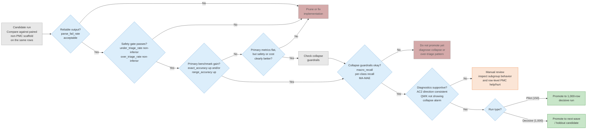

# Experiment Results

> Decision doc. Full per-experiment writeups: [`experiment_results_archive.md`](./experiment_results_archive.md).
> Machine-readable log: [`experiments/results/experiment_log.csv`](./experiments/results/experiment_log.csv).
> All experiments use `data/splits/dev_tune.csv` (1,000 rows, seed 42 deterministic subset of `data/splits/dev.csv`).

## Evaluation methodology

Results are evaluated using a **multilevel metric stack**, not a single headline score.
The tiers, in priority order:

1. **Benchmark** — `exact_accuracy`, `range_accuracy` (for comparability with Gaber et al.)
2. **Safety** — `under_triage_rate`, `over_triage_rate` (asymmetric clinical harm)
3. **Imbalance diagnostics** — `macro_recall`, `per_class_recall`, `MA-MAE` (collapse detection)
4. **Chance-adjusted diagnostics** — `linear_weighted_gwet_ac2`, `quadratic_weighted_kappa`
   (AC2 preferred; QWK retained as collapse alarm only)

Promotion decisions require passing gates at each level — see [Promotion ladder](#promotion-ladder).
See `docs/paper_notes.md § Evaluation metrics` for full rationale and sources.

---

## Current best config

**G3 Flash tool_use** — highest benchmark scores (exact_acc=62.7%, range_acc=78.3%) and strongest ordinal agreement (AC2=0.775, κ=0.485). However, **safety-blocked**: under-triage 21.6% (vs 10.8% G2.5 baseline), ESI-4 recall partially recovered (0.333) but not resolved.

**Current safe best: W1-ref** (G2.5 Flash fewshot) — exact_acc=53.4%, range_acc=88.3%, under-triage=10.8%. Lower benchmark scores but passes all safety and imbalance gates.

---

## Leaderboard — decisive runs (n=1,000)

Columns follow the multilevel metric stack: benchmark → safety → imbalance → chance-adjusted diagnostics.

| Experiment | Model | Strategy | Exact Acc | Range Acc | Under-triage | Over-triage | Macro Recall | MA-MAE | AC2 | κ | recall_ESI4 | Cost | Verdict |
|---|---|---|---|---|---|---|---|---|---|---|---|---|---|
| **G3-tool** | G3 Flash | tool_use | **62.7%** | 78.3% | 21.6% | 15.7% | **0.467** | **0.587** | **0.775** | **0.485** | **0.333** | $6.46 | **safety-blocked** |
| G4 pro tool_use LOW | Pro | tool_use | **63.1%** | 76.6% | 23.2% | **13.7%** | 0.382 | 0.713 | 0.778 | 0.487 | 0.000 | — | **safety-blocked** (UT +1.6pp vs anchor) |
| G4 pro tool_use_pmc MED | Pro | tool_use_pmc | 62.3% | **79.4%** | 20.5% | 17.2% | 0.377 | 0.672 | 0.776 | 0.477 | 0.000 | — | pruned (Pro ≈ Flash) |
| G4 pro critic (patched) | Pro / Flash | two_role | 61.6% | 79.2% | 20.7% | 17.8% | 0.371 | 0.676 | 0.772 | 0.466 | 0.000 | — | pruned (Pro ≈ Flash, 0.9% fail) |
| G3 decision_tree | G3 Flash | tool_use_dt | 62.6% | 78.0% | 21.9% | 15.5% | 0.419 | 0.639 | 0.774 | 0.472 | 0.167 | $8.35 | near-neutral vs anchor |
| G3 tool_use_pmc | G3 Flash | tool_use_pmc | 60.8% | 81.6% | 18.3% | 20.9% | 0.364 | 0.685 | 0.768 | 0.433 | 0.000 | $10.17 | pruned (over-triage +5pp) |
| G3 two_role | G3 Flash | two_role | 60.2% | 81.2% | 18.7% | 21.0% | 0.358 | 0.688 | 0.765 | 0.428 | 0.000 | $7.07 | pruned (ESI-3 collapse) |
| **G3-ref** | G3 Flash | fewshot | 61.6% | 73.5% | 26.4% | 12.0% | 0.381 | 0.681 | 0.766 | 0.478 | 0.000 | $3.52 | **safety-blocked** |
| **G3-gated** | G3 Flash | fewshot+gate | 61.7% | 75.2% | 24.7% | 13.5% | 0.374 | 0.684 | 0.768 | 0.470 | 0.000 | $4.92 | **safety-blocked** |
| **W1-ref** | G2.5 Flash | fewshot | 53.4% | **88.3%** | **10.8%** | 35.8% | 0.378 | 0.761 | 0.727 | 0.382 | 0.000 | $1.78 | **current safe best** |
| W2B tool_use | G2.5 Flash | tool_use | 54.2% | 84.3% | 15.5% | 30.3% | 0.347 | 0.747 | 0.732 | 0.352 | 0.000 | $4.62 | pruned (range_acc −4pp) |
| W1-gated | G2.5 Flash | fewshot+gate | 51.9% | 87.6% | 11.8% | 36.3% | 0.341 | 0.832 | 0.719 | 0.288 | 0.000 | $3.87 | pruned |
| W1-rag | G2.5 Flash | fewshot+RAG | 50.1% | 88.5% | 10.9% | 39.0% | 0.316 | 0.852 | 0.636 | 0.219 | 0.000 | $6.54 | pruned |
| W2B tool_rag | G2.5 Flash | tool_use+RAG | 52.7% | 85.6% | 13.8% | 33.5% | 0.332 | 0.845 | 0.653 | 0.288 | 0.000 | $11.32 | pruned |

### Promotion ladder flowchart

### Experiment design flowchart

```mermaid
flowchart LR
    Start("Start<br>V2 PMC-RAG goal<br>Test additive PMC value<br>on top of few-shot")
    W1Setup("Wave 1 Setup<br>Use dev_tune.csv<br>Pilots: first 150 rows<br>Decisive: first 1,000 rows<br>Log path, row count, SHA256")
    W1Ref("W1 Reference<br>Few-shot only<br>No PMC retrieval<br>n = 1,000")
    W1Add("W1 Additive PMC<br>Few-shot + PMC<br>top_k = 5, No gate<br>n = 1,000")
    W1Gate("W1 Gated PMC<br>Few-shot + PMC<br>Distance gate = 0.25<br>n = 1,000")
    EvalW1("Evaluate Wave 1<br>Multilevel metric stack<br>vs few-shot baseline")
    DecPMC{"PMC additive?<br>Passes promotion<br>ladder gates"}
    W2A("Wave 2A<br>PMC optimization branch")
    ThreshSweep("Threshold Sweep<br>Gates: 0.20 to 0.30<br>Few-shot + PMC<br>n = 1,000")
    RerankerPilot("Reranker Pilot<br>Retrieve top 20<br>Keep top 5<br>n = 150")
    DecReranker{"Reranker<br>promising?"}
    PromoteReranker("Promote Reranker<br>Run reranker branch<br>at n = 1,000")
    StopReranker["Stop Reranker"]
    W2B("Wave 2B<br>Tool-use orchestration")
    Pilot1("W2B-P1: Single-agent<br>PMC tool only<br>(no case bank)<br>n = 150")
    Pilot2("W2B-P2: Single-agent<br>Case bank + PMC tool<br>n = 150")
    DecOrch{"Best tool-use<br>variant identified?"}
    W2BDecisive("W2B Decisive<br>Scale tool_use and<br>tool_use_rag to<br>n = 1,000")
    StopOrch["Stop Orchestration"]
    W3("Wave 3: Generalizability<br>Key configs on new model<br>(G3 Flash)<br>fewshot / tool_use / gated<br>n = 1,000")
    FinalEval("Final Evaluation<br>Compare to paired<br>non-PMC scaffold")
    RowAnalysis("Row-level PMC Analysis<br>Changed, helped, hurt, neutral<br>By ESI and distance")

    Start --> W1Setup
    W1Setup --> W1Ref
    W1Setup --> W1Add
    W1Setup --> W1Gate
    W1Ref --> EvalW1
    W1Add --> EvalW1
    W1Gate --> EvalW1
    EvalW1 --> DecPMC
    DecPMC -->|"Yes"| W2A
    DecPMC -->|"No"| W2B
    W2A --> ThreshSweep
    W2A --> RerankerPilot
    RerankerPilot --> DecReranker
    DecReranker -->|"Yes"| PromoteReranker
    DecReranker -->|"No"| StopReranker
    W2B --> Pilot1
    W2B --> Pilot2
    Pilot1 --> DecOrch
    Pilot2 --> DecOrch
    DecOrch -->|"Yes"| W2BDecisive
    DecOrch -->|"No"| StopOrch
    ThreshSweep --> W3
    PromoteReranker --> W3
    W2BDecisive --> W3
    W3 --> FinalEval
    FinalEval --> RowAnalysis

    classDef setup fill:#E8E8E8,stroke:#999999,color:#333333
    classDef wave1 fill:#DCEEFB,stroke:#5B9BD5,color:#333333
    classDef wave2a fill:#E2F0D9,stroke:#70AD47,color:#333333
    classDef wave2b fill:#FBE5D6,stroke:#ED7D31,color:#333333
    classDef wave3 fill:#E8D5F5,stroke:#9B59B6,color:#333333
    classDef evalNode fill:#FFF2CC,stroke:#BF9000,color:#333333
    classDef stopNode fill:#D5AAAA,stroke:#999999,color:#555555
    classDef skipped fill:#F5F5F5,stroke:#CCCCCC,color:#AAAAAA

    class Start,W1Setup setup
    class W1Ref,W1Add,W1Gate,EvalW1,DecPMC wave1
    class W2A,ThreshSweep,RerankerPilot,DecReranker,PromoteReranker skipped
    class W2B,Pilot1,Pilot2,DecOrch,W2BDecisive wave2b
    class W3 wave3
    class FinalEval,RowAnalysis evalNode
    class StopReranker,StopOrch stopNode
```

---

## Key findings

### Framework-level findings

1. **Tool-use is the strongest framework pattern.** Giving the model on-demand access to a structured case bank generalizes across models (G2.5 Flash, G3 Flash) and consistently outperforms passive context injection on benchmark, safety, and diagnostic metrics. This is the core framework finding: active orchestration beats passive retrieval.

2. **Passive context injection is the wrong pattern for this task.** Every configuration that adds unstructured context to the prompt — RAG articles, ESI handbook (99k chars), longer snippets, more articles — degrades performance across all metric tiers. The model's parametric knowledge is better than noisy retrieved context. Framework implication: retrieval components need task-specific structure, not raw document injection.

3. **Strategy ranking is model-stable.** tool_use > fewshot >= gated RAG holds on both G2.5 Flash and G3 Flash across benchmark metrics (exact_acc, range_acc) and diagnostics (AC2). Framework patterns generalize across model versions.

### Task-specific findings

4. **PMC articles lack triage-specific signal.** Confirmed across 7 configurations: passive RAG (E02a, W1-rag), distance-gated (E11, W1-gated), active tool (W2B-P1/P2), and all retrieval backends (FAISS, BM25, hybrid). PMC context consistently degrades benchmark and diagnostic metrics.

5. **Gemini 3 Flash trades safety for accuracy.** Exact accuracy jumps +8-10pp across all configs, but under-triage rises from 10-15% to 21-26% and ESI-4 recall collapses to 0.000 (except tool_use: 0.333). The multilevel stack catches what exact accuracy alone would miss: not a safe drop-in replacement.

6. **Over-triage vs under-triage is model-dependent.** Gemini over-triages (safe direction, 35.8%); Haiku under-triages (dangerous, 28.7%). Despite Haiku's higher QWK, Gemini is clinically safer — AC2 confirms (0.727 vs 0.708).

7. **ESI-4 is universally collapsed.** No configuration predicts ESI-4 reliably — macro_recall and per-class recall expose this where exact accuracy cannot. Tool-use on G3 Flash partially recovers it (recall=0.333).

### Methodological findings

8. **Pilot results overestimate.** 150-row pilots consistently inflate metrics by +0.05-0.08 vs 1K decisive runs. Treat all pilot numbers as upper bounds.

9. **Query formulation doesn't matter.** concat, hpi_only, rewrite, and multi-facet decomposition all produce similar results. The bottleneck is corpus-task mismatch, not query construction.

10. **Model upgrade is not a lever at the Flash→Pro boundary.** G3 Flash→Pro at 1K scale: Pro tool_use (63.1%) vs Flash tool_use (62.7%) = +0.4pp exact, +0.002 AC2. Three Pro configs (tool_use, tool_use_pmc, two_role) all cluster within ±1pp of Flash. Earlier G2.5 pilot (E08) suggested +0.066 κ but pilot inflation applies. Few-shot examples (+0.072 κ) and tool-use (+0.093 κ) remain stronger levers at lower cost.

---

## Ruled-out framework components

These patterns have been tested across multiple configurations and consistently fail the
promotion ladder. Do not revisit without a fundamentally different approach:

- **Passive PMC retrieval** (any backend, any gating) — corpus lacks task-specific signal
- **Query reformulation** (rewrite, multi-facet, adaptive re-query) — bottleneck is corpus, not query
- **Full handbook injection** (99k chars) — context dilution degrades all metric tiers
- **CoT-private prompting** — degrades benchmark metrics, increases over-triage
- **BM25 or hybrid retrieval** — FAISS outperforms, but all backends underperform LLM-only

---

## Comparison with Gaber et al. (2024)

Gaber et al. Table 1 (n=2,000, clinical user setting — closest to ours since we include vitals):

| Model | Exact Match (%) | Range Acc (%) |
|---|---|---|
| RAG-Assisted LLM (Claude 3.5 Sonnet) | 65.75 | 77.15 |
| Claude 3.5 Sonnet | 64.40 | 82.40 |
| Claude 3 Sonnet | 61.65 | 74.55 |
| Claude 3 Haiku | 59.00 | 66.15 |

Our best comparable results:

| Config | Model | n | Exact Acc (%) | Range Acc (%) | κ |
|---|---|---|---|---|---|
| G3 tool_use | G3 Flash | 1000 | **62.7** | 78.3 | **0.485** |
| G3 decision_tree | G3 Flash | 1000 | 62.6 | 78.0 | 0.472 |
| G3 fewshot | G3 Flash | 1000 | 61.6 | 73.5 | 0.478 |
| G3 tool_use_pmc | G3 Flash | 1000 | 60.8 | 81.6 | 0.433 |
| G3 two_role | G3 Flash | 1000 | 60.2 | 81.2 | 0.428 |
| W1-ref fewshot | G2.5 Flash | 1000 | 53.4 | **88.3** | 0.382 |
| W2B tool_use | G2.5 Flash | 1000 | 54.2 | 84.3 | 0.352 |

### Key comparisons

1. **Exact accuracy gap is closing.** G3 Flash tool_use (62.7%) approaches Gaber's Claude 3 Sonnet (61.65%) and Claude 3.5 Sonnet (64.40%). G2.5 Flash lags at 53-54%.
2. **Range accuracy is higher on G2.5, lower on G3.** G2.5 Flash (84-88%) exceeds Gaber's best (82.4%) due to systematic over-triage. G3 Flash (73-78%) is closer to Gaber's range due to under-triage shift.
3. **The RAG paradox appears in both studies.** Gaber: RAG helped exact match +1.35pp but hurt range -5.25pp. Ours: RAG hurts both. Neither study shows a clear benefit from retrieval augmentation.
4. **Gaber did not report quadratic kappa**, making direct ordinal-agreement comparison impossible.

---

## Wave 2B–G4 orchestration & guardrail screen (500-row, paired vs G3 anchor)

**Question:** can new orchestration variants or guardrails beat the G3 `tool_use` anchor on the same 500 rows without worsening under-triage?

All candidates: `gemini-3-flash-preview`, n=500, paired by `stay_id` vs first-500 slice of G3 `tool_use` 1K run. Deltas in parentheses relative to anchor.

| Config | Exact | Range | MAE | UT / OT | Cost | AC2 | κ | ESI-3 | Net |
|---|---|---|---|---|---|---|---|---|---|
| *Gaber: Claude 3.5 Sonnet RAG* | *65.8* | *77.2* | *—* | *— / —* | *—* | *—* | *—* | *—* | *—* |
| *Gaber: Claude 3.5 Sonnet* | *64.4* | *82.4* | *—* | *— / —* | *—* | *—* | *—* | *—* | *—* |
| **G3 anchor** | **61.0** | **77.2** | **.404** | **22.6 / 16.4** | **—** | **.763** | **.446** | **.626** | **ref** |
| `tool_use_pmc` | 60.0 (-1.0) | 81.4 (+4.2) | .406 (+.002) | 18.4 (-4.2) / 21.6 (+5.2) | $5.05 | .763 (+.000) | .422 (-.024) | .514 (-.112) | -2 |
| `tool_use_dual` | 60.0 (-1.0) | 77.2 (+0.0) | .408 (+.004) | 22.6 (+0.0) / 17.4 (+1.0) | $4.01 | .760 (-.003) | .449 (+.003) | .591 (-.035) | -3 |
| `two_role` *(2.5-flash)* | 50.4 (-10.6) | 89.8 (+12.6) | .504 (+.100) | 9.6 (-13.0) / 40.0 (+23.6) | $3.59 | .640 (-.123) | .278 (-.168) | .138 (-.488) | -50 |
| `two_role` *(G3 rerun)* | 61.2 (+0.2) | 81.7 (+4.5) | .394 (-.010) | 18.1 (-4.5) / 20.7 (+4.3) | — | .769 (+.006) | .432 (-.014) | .527 (-.099) | +3 |
| `two_role` *(Pro critic, 1K)* | 62.2 (+1.2) | 78.9 (+1.7) | .384 (-.020) | 21.0 (-1.6) / 16.8 (+0.4) | — | .776 (+.013) | .471 (+.025) | .609 (-.017) | +9 |
| `tool_use` *(Pro LOW, 1K)* | 63.1 (+2.1) | 76.6 (-0.6) | .377 (-.027) | 23.2 (+0.6) / 13.7 (-2.7) | — | .778 (+.015) | .487 (+.041) | .695 (+.069) | — |
| `tool_use_pmc` *(Pro MED, 1K)* | 62.3 (+1.3) | 79.4 (+2.2) | .382 (-.022) | 20.5 (-2.1) / 17.2 (+0.8) | — | .776 (+.013) | .477 (+.031) | .614 (-.012) | — |
| `two_role` *(Pro patched, 1K)* | 61.6 (+0.6) | 79.2 (+2.0) | .390 (-.014) | 20.7 (-1.9) / 17.8 (+1.4) | — | .772 (+.009) | .466 (+.020) | .595 (-.031) | — |
| `decision_tree` | 61.2 (+0.2) | 77.6 (+0.4) | .398 (-.006) | 22.2 (-0.4) / 16.6 (+0.2) | $4.11 | .766 (+.003) | .438 (-.008) | .630 (+.004) | +3 |
| `dt_boundary_review` | 59.2 (-1.8) | 77.6 (+0.4) | .420 (+.016) | 22.2 (-0.4) / 18.6 (+2.2) | $5.19 | .753 (-.010) | .411 (-.035) | .577 (-.049) | -7 |
| `vitals_guardrail` | 58.4 (-2.6) | 79.6 (+2.4) | .424 (+.020) | 20.2 (-2.4) / 21.4 (+5.0) | $3.57 | .752 (-.011) | .398 (-.048) | .514 (-.112) | -12 |

*Gaber rows from Table 1, n=2000, clinical-user setting. UT = under-triage %, OT = over-triage %. Net = paired row-level lift (helped − hurt).*

### Interpretation

1. **No candidate beats the anchor.** The best net lift is +3 (`decision_tree`), statistically indistinguishable from noise at n=500.
2. **ESI-3 recall is the universal failure mode.** Every candidate that changes predictions preferentially shifts ESI-3→2. The anchor's 0.626 ESI-3 recall is already a ceiling for these architectures — adding upTriage pressure (boundary review, vitals guardrail) or retrieval (PMC) makes it worse, not better.
3. **Range accuracy and under-triage are inversely coupled with exact accuracy.** `tool_use_pmc` and `vitals_guardrail` improve range/UT by over-triaging more, which inflates range accuracy (Gaber definition counts 1-level over-triage as correct) while destroying exact accuracy and ESI-3 recall.
4. **`two_role` ESI-3 collapse was mostly a model problem.** G3 flash rerun: exact 61.2% (was 50.4%), κ 0.432 (was 0.278), ESI-3 recall 0.527 (was 0.138), net lift +3 (was -50). The critic still over-triages ESI-3→2 (-20 net at ESI-3) but gains +24 at ESI-2 — best ESI-2 recall of any candidate (0.807). Architecture is viable on a stronger model but still doesn't beat the anchor on ESI-3.
5. **Pro adds negligible value over Flash.** Tested across three configurations — tool_use LOW thinking (63.1% exact, AC2 0.778), tool_use_pmc MEDIUM (62.3%, AC2 0.776), two_role critic patched (61.6%, AC2 0.772) — Pro clusters within ±1pp of Flash on all metrics. The best Pro result (tool_use LOW, 63.1%) edges out Flash (62.7%) by 0.4pp but worsens under-triage (+1.6pp). ESI-4 collapse persists at 0.000 across all Pro configs. Model upgrade is not a lever for this task at the Flash→Pro boundary.
6. **Pro critic reliability resolved but value unchanged.** Retry of 171 error rows (5 shards vs original 20) reduced failures from 17.1% to 0.9%. Patched results (61.6% exact, AC2 0.772) are within noise of the pre-patch 829-row eval (62.2%, 0.776), confirming error rows were not systematically biased.
6. **Our best (G3 anchor) is competitive with Gaber.** Exact accuracy 61.0% vs Gaber's Claude 3 Sonnet 61.65%; range accuracy 77.2% matches Gaber's RAG-assisted 3.5 Sonnet 77.15%. Gaber did not report κ, AC2, or per-class recall.

## Open experiments / next steps

1. **Fix G3 Flash under-triage.** The +0.1 κ gain is real but safety-blocked. Options:
   - Output distribution correction (post-hoc calibration)
   - ESI-4/5 exemplar injection into case bank
   - Threshold-based prediction adjustment

2. **Holdout confirmation.** Best safe config (W1-ref, κ=0.382) has not been run on `dev_holdout.csv` (500 rows, run once).

3. **Haiku at 1K scale.** Haiku pilot (κ=0.438) is strong but only n=150. Given pilot inflation pattern, expect ~0.38-0.40 at 1K. Constrained by Tier 1 rate limits (50 RPM).

4. **G4 guardrail experiments complete.** Decision tree prompt is near-neutral; boundary review and vitals guardrail are net-negative. The fundamental ESI-3 over-triage problem cannot be fixed by adding more upTriage pressure. Future work should focus on downTriage mechanisms or calibration.

5. **G4 Pro experiments complete.** Three Pro configs tested at 1K scale — tool_use LOW (63.1%), tool_use_pmc MEDIUM (62.3%), two_role critic patched (61.6%). All within ±1pp of Flash. Pro critic reliability fixed (0.9% fail). Conclusion: Pro is not a lever for this task. No further Pro experiments planned.

6. **Difficulty-gated RAG.** Replace distance gating with a difficulty-aware gate — target cases at risk of under-triage rather than cases with low embedding distance.

---

## Promotion ladder

The promotion ladder evaluates *framework configurations* — each candidate represents an
architectural choice (tool-use, passive retrieval, gating strategy, orchestration pattern).
The ESI triage metrics below are the task-specific instantiation; the ladder structure itself
(reliability → safety → benchmark → imbalance → diagnostics) generalizes to any clinical
decision-support evaluation.

Each candidate run is compared against its paired non-PMC scaffold on the same rows. Failure at any step prunes the candidate:

1. **Reliable output?** parse_fail_rate acceptable
2. **Safety gate?** under_triage_rate and over_triage_rate non-inferior to baseline
3. **Primary benchmark gain?** exact_accuracy up and/or range_accuracy up
4. **Primary flat but safety clearly better?** If yes, continue. If no, prune.
5. **Collapse guardrails?** macro_recall, per-class recall, MA-MAE okay
6. **Diagnostics supportive?** AC2 direction consistent, QWK not showing collapse alarm
7. **Promote:** pilot (n=150) → decisive run (n=1,000); decisive → next wave / holdout candidate

---

## Data splits

| Split | File | Rows | Purpose |
|---|---|---|---|
| dev_tune | `data/splits/dev_tune.csv` | 1,000 | All strategy selection |
| dev_holdout | `data/splits/dev_holdout.csv` | 500 | Final confirmation — run once |

Row IDs (`stay_id`) are fixed. When `n_rows < subset size`, use the first N rows after deterministic ordering by `stay_id`.
