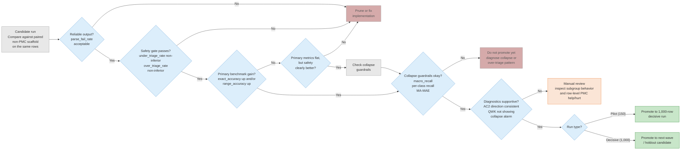

# Experiment Results

## Table of contents

- [Promotion ladder](#promotion-ladder)
- [Data splits](#data-splits)
- [**I. Baselines & LLM Fundamentals**](#i-baselines--llm-fundamentals)
  - [E00.5 — LLM-only baseline](#e005--llm-only-baseline-anchor)
  - [Cross-model comparison (E08, E13, E14)](#cross-model-comparison-e08-e13-e14)
  - [Prompt engineering (E05, E18)](#prompt-engineering-e05-e18)
  - [Tool-use: ESI case bank (E19)](#tool-use-esi-case-bank-e19)
- [**II. Query Formulation**](#ii-retrieval-pipeline-query-formulation)
  - [E02a / E02b — Core query ablation](#e02a--e02b--core-query-ablation-concat-vs-hpi_only-vs-rewrite)
  - [E09 — Multi-facet decomposition](#e09--multi-facet-query-decomposition)
- [**III. Context Optimization**](#iii-retrieval-pipeline-context-optimization)
  - [E04 — Snippet cleaning](#e04--snippet-cleaning-front-matter-stripping-2k-context)
  - [E06 — 8k context (raw)](#e06--8k-context-chars-raw-no-stripping)
  - [E07 — 8k + strip (best RAG)](#e07--8k-context--front-matter-stripping-best-rag-config)
- [**IV. Context Dilution**](#iv-context-dilution-effect)
  - [E03a / E03b — Handbook ablation](#e03a--e03b--handbook-prefix-ablation-22-factorial)
- [**V. Retrieval Gating**](#v-retrieval-gating--adaptive-strategies)
  - [E11 — Distance-gated retrieval](#e11--distance-gated-retrieval)
- [**VI. Backend Comparison**](#vi-retrieval-backend-comparison)
  - [E15 / E16 — FAISS vs BM25 vs Hybrid](#e15--e16--faiss-vs-bm25-vs-hybrid-rrf)
- [**VII. V2 Wave 1 — Fewshot Scaffold + PMC**](#vii-v2-wave-1--fewshot-scaffold--pmc)
  - [W1-ref — Gemini fewshot baseline (1k)](#w1-ref--gemini-fewshot-baseline-1000-rows)
  - [W1-rag & W1-gated — Gemini fewshot+RAG (1k)](#w1-rag--w1-gated--gemini-fewshotrag-1000-rows)
  - [Haiku Pilot Results (150 rows each)](#haiku-pilot-results-150-rows-each-claude-haiku-4-5)
  - [Cross-model safety divergence](#cross-model-safety-divergence)
- [**VIII. V2 Wave 2B — Tool-Use Orchestration Pilots**](#viii-v2-wave-2b--tool-use-orchestration-pilots)
  - [W2B-P1 — PMC tool only (150 rows)](#w2b-p1--pmc-tool-only-150-rows)
  - [W2B-P2 — Case bank + PMC tool (150 rows)](#w2b-p2--case-bank--pmc-tool-150-rows)
  - [W2B ablation comparison](#w2b-ablation-comparison)
  - [W2B Decisive 1K — tool_use vs tool_use_rag](#w2b-decisive-1k--tool_use-vs-tool_use_rag)
- [**Wave 3 — Gemini 3 Flash Generalizability**](#wave-3--gemini-3-flash-generalizability)
  - [G3-ref — Fewshot baseline (1K)](#g3-ref--fewshot-baseline-1k)
  - [G3-tool — Tool-use case-bank-only (1K)](#g3-tool--tool-use-case-bank-only-1k)
  - [G3-gated — Distance-gated RAG (1K)](#g3-gated--distance-gated-rag-1k)
  - [Gemini 3 Flash cross-config comparison](#gemini-3-flash-cross-config-comparison)
- [**IX. Synthesis**](#ix-cross-experiment-synthesis)
  - [Summary table](#summary-table)
  - [Pilot leaderboard (n=150)](#pilot-leaderboard-n150)
  - [Comparison with Gaber et al.](#comparison-with-gaber-et-al-2024)
- [G4: Pro tool_use LOW thinking](#g4-pro-tool_use-with-low-thinking-2026-03-14)
  - [G4: Pro tool_use_pmc MEDIUM thinking](#g4-pro-tool_use_pmc-with-medium-thinking-2026-03-14)
  - [G4: Pro critic retry and patch](#g4-pro-critic-retry-and-patch-2026-03-14)
- [**X. Future Directions**](#x-future-directions)

---

> Numeric results only. All experiments use `data/splits/dev_tune.csv` (1,000 rows, seed 42 deterministic subset of `data/splits/dev.csv`).

---

## Promotion ladder

The promotion ladder evaluates *framework configurations* — each candidate represents an
architectural choice (tool-use, passive retrieval, gating strategy, orchestration pattern).
The ESI triage metrics below are the task-specific instantiation; the ladder structure itself
(reliability → safety → benchmark → imbalance → diagnostics) generalizes to any clinical
decision-support evaluation.

Each candidate run is compared against its paired non-PMC scaffold on the same rows. Promotion decisions follow this sequence — failure at any step prunes or pauses the candidate:

1. **Reliable output?** `parse_fail_rate` acceptable → else prune or fix implementation.
2. **Safety gate?** `under_triage_rate` and `over_triage_rate` non-inferior to baseline → else prune.
3. **Primary benchmark gain?** `exact_accuracy` up and/or `range_accuracy` up → else check step 4.
4. **Primary flat but safety clearly better?** If yes → proceed to step 5. If no → prune.
5. **Collapse guardrails?** `macro_recall`, per-class recall, `MA-MAE` okay → else diagnose collapse pattern.
6. **Diagnostics supportive?** AC2 direction consistent, QWK not showing collapse alarm → else manual review (inspect subgroup behavior, row-level PMC help/hurt).
7. **Promote:** pilot (n=150) → decisive run (n=1,000); decisive → next wave / holdout candidate.

### Promotion ladder flowchart



### Experiment design flowchart

```mermaid
flowchart LR
    Start("Start<br>V2 PMC-RAG goal<br>Test additive PMC value<br>on top of few-shot")
    W1Setup("Wave 1 Setup<br>Use dev_tune.csv<br>Pilots: first 150 rows<br>Decisive: first 1,000 rows<br>Log path, row count, SHA256")
    W1Ref("W1 Reference<br>Few-shot only<br>No PMC retrieval<br>n = 1,000")
    W1Add("W1 Additive PMC<br>Few-shot + PMC<br>top_k = 5, No gate<br>n = 1,000")
    W1Gate("W1 Gated PMC<br>Few-shot + PMC<br>Distance gate = 0.25<br>n = 1,000")
    EvalW1("Evaluate Wave 1<br>Multilevel metric stack<br>vs few-shot baseline")
    DecPMC{"PMC additive?<br>Passes promotion<br>ladder gates"}
    W2A("Wave 2A<br>PMC optimization branch")
    ThreshSweep("Threshold Sweep<br>Gates: 0.20 to 0.30<br>Few-shot + PMC<br>n = 1,000")
    RerankerPilot("Reranker Pilot<br>Retrieve top 20<br>Keep top 5<br>n = 150")
    DecReranker{"Reranker<br>promising?"}
    PromoteReranker("Promote Reranker<br>Run reranker branch<br>at n = 1,000")
    StopReranker["Stop Reranker"]
    W2B("Wave 2B<br>Tool-use orchestration")
    Pilot1("W2B-P1: Single-agent<br>PMC tool only<br>(no case bank)<br>n = 150")
    Pilot2("W2B-P2: Single-agent<br>Case bank + PMC tool<br>n = 150")
    DecOrch{"Best tool-use<br>variant identified?"}
    W2BDecisive("W2B Decisive<br>Scale tool_use and<br>tool_use_rag to<br>n = 1,000")
    StopOrch["Stop Orchestration"]
    W3("Wave 3: Generalizability<br>Key configs on new model<br>(G3 Flash)<br>fewshot / tool_use / gated<br>n = 1,000")
    FinalEval("Final Evaluation<br>Compare to paired<br>non-PMC scaffold")
    RowAnalysis("Row-level PMC Analysis<br>Changed, helped, hurt, neutral<br>By ESI and distance")

    Start --> W1Setup
    W1Setup --> W1Ref
    W1Setup --> W1Add
    W1Setup --> W1Gate
    W1Ref --> EvalW1
    W1Add --> EvalW1
    W1Gate --> EvalW1
    EvalW1 --> DecPMC
    DecPMC -->|"Yes"| W2A
    DecPMC -->|"No"| W2B
    W2A --> ThreshSweep
    W2A --> RerankerPilot
    RerankerPilot --> DecReranker
    DecReranker -->|"Yes"| PromoteReranker
    DecReranker -->|"No"| StopReranker
    W2B --> Pilot1
    W2B --> Pilot2
    Pilot1 --> DecOrch
    Pilot2 --> DecOrch
    DecOrch -->|"Yes"| W2BDecisive
    DecOrch -->|"No"| StopOrch
    ThreshSweep --> W3
    PromoteReranker --> W3
    W2BDecisive --> W3
    W3 --> FinalEval
    FinalEval --> RowAnalysis

    classDef setup fill:#E8E8E8,stroke:#999999,color:#333333
    classDef wave1 fill:#DCEEFB,stroke:#5B9BD5,color:#333333
    classDef wave2a fill:#E2F0D9,stroke:#70AD47,color:#333333
    classDef wave2b fill:#FBE5D6,stroke:#ED7D31,color:#333333
    classDef wave3 fill:#E8D5F5,stroke:#9B59B6,color:#333333
    classDef evalNode fill:#FFF2CC,stroke:#BF9000,color:#333333
    classDef stopNode fill:#D5AAAA,stroke:#999999,color:#555555
    classDef skipped fill:#F5F5F5,stroke:#CCCCCC,color:#AAAAAA

    class Start,W1Setup setup
    class W1Ref,W1Add,W1Gate,EvalW1,DecPMC wave1
    class W2A,ThreshSweep,RerankerPilot,DecReranker,PromoteReranker skipped
    class W2B,Pilot1,Pilot2,DecOrch,W2BDecisive wave2b
    class W3 wave3
    class FinalEval,RowAnalysis evalNode
    class StopReranker,StopOrch stopNode
```



---

## Data splits


| Split       | File                          | Rows  | Purpose                             |
| ----------- | ----------------------------- | ----- | ----------------------------------- |
| dev_tune    | `data/splits/dev_tune.csv`    | 1,000 | All strategy selection (E00.5–E02)  |
| dev_holdout | `data/splits/dev_holdout.csv` | 500   | Final confirmation (E05) — run once |


Row IDs (`stay_id`) are fixed for the experiment cycle. When `n_rows < subset size`, use the first N rows after deterministic ordering by `stay_id`.

---
# I. Baselines & LLM Fundamentals

**Most retrieval variants underperform LLM-only (κ=0.338). The strongest levers are triage-native guidance — few-shot ESI examples (κ=0.410), tool-use case bank (κ=0.431) — and model upgrade (Pro κ=0.404). Distance-gated RAG (E11 gate=0.25, κ=0.366) is the only retrieval config to beat the baseline.**

## E00.5 — LLM-only baseline (anchor)

**Purpose:** Establish a no-RAG anchor. How well does the model triage using only its pretrained knowledge + the patient case, with zero retrieved context?

**Script:** `experiments/query_strategy_sweep.py --mode llm --n-rows 150`


| Metric              | Value     |
| ------------------- | --------- |
| exact_accuracy      | 0.587     |
| range_accuracy      | 0.913     |
| MAE                 | 0.427     |
| quadratic_kappa     | **0.338** |
| parse_fail_rate     | 0%        |
| generation_cost_usd | $0.023    |


> *Note: An earlier n=100 run produced κ=0.356. The n=150 run is the canonical baseline used for all comparisons.*

Kappa 0.338 sits in the moderate range. All errors are adjacent-level. Retrieval has room to help — but must beat 0.338 to justify overhead.

---

## Cross-model comparison (E08, E13, E14)

Model upgrade yields significant gains without pipeline changes, though triage-native guidance (few-shot, tool-use) ultimately surpasses it.

### Results


| Model              | Experiment | quadratic_κ | exact_acc | adj1_acc | range_acc | MAE   | cost_usd  | tokens/row |
| ------------------ | ---------- | ----------- | --------- | -------- | --------- | ----- | --------- | ---------- |
| Gemini 2.5 Flash   | E00.5      | 0.338       | 0.587     | 0.993    | 0.913     | 0.427 | $0.023    | ~404       |
| Claude Haiku 4.5   | E13        | **0.369**   | **0.620** | 0.980    | 0.727     | 0.407 | ~$0.10    | ~644       |
| Gemini 2.5 Pro     | E08        | **0.404**   | 0.580     | 0.993    | 0.953     | 0.427 | $1.821    | ~404       |
| Claude Sonnet 4.6  | E14        | 0.236       | 0.540     | 1.000    | 0.947     | 0.460 | ~$0.31    | ~644       |


### Interpretation

1. **Pro (κ=0.404) gains +0.066 over Flash** with zero pipeline changes. Errors tighten to off-by-one; range accuracy jumps from 91.3% to 95.3%. Cost increases ~80x due to 173k thinking tokens.
2. **Haiku (κ=0.369) is surprisingly competitive** at ~1/3 the cost of Flash thinking tokens. Highest exact accuracy (62.0%), but lower range accuracy (72.7%) — Haiku over-triages less conservatively, meaning more under-triage.
3. **Sonnet 4.6 (κ=0.236) underperforms all others** despite being the most capable Claude model. It over-triages almost universally (adj1=100%, range=94.7%), tanking exact accuracy and kappa. This mirrors the Pro pattern taken to an extreme — more capable models trend toward conservative over-triage.
4. **Model upgrade is a strong lever but not the strongest.** Flash→Pro (+0.066) is surpassed by few-shot examples (E18: +0.072) and tool-use (E19: +0.093), both on Flash at far lower cost.

**E13 output:** `data/runs/E13_haiku_llm_baseline/` | **E14 output:** `data/runs/E14_sonnet46_llm_baseline/` | **E08 output:** `data/runs/E08_gemini25pro_llm/`

---

## Prompt engineering (E05, E18)

Prompt template specificity (E05) has negligible impact, but few-shot demonstrations from the ESI Handbook (E18) produce a meaningful kappa lift.

### E05 — Gaber et al. template

LLM-only comparison isolating the prompt template. The Gaber prompt adds more detailed ESI descriptions with concrete examples per level, adapted from `third_part_code/medLLMbenchmark/Claude_triage_ClinicalUser.py`.


| Prompt template | Exact acc | Range acc | MAE   | κ         |
| --------------- | --------- | --------- | ----- | --------- |
| default (E00.5) | 58.7%     | 91.3%     | 0.427 | **0.338** |
| gaber (E05)     | 56.0%     | 93.3%     | 0.440 | 0.331     |


Kappa is effectively identical (Δ = −0.007). The model's triage performance is insensitive to whether ESI levels are described with brief phrases or detailed examples. The prompt template is not a lever for improvement.

**Output files:** `data/runs/E05_gaber_llm/`

### E18 — CoT / few-shot ablation (2×2 pilot)

2×2 pilot on 150 dev_tune rows: {default, CoT-private} × {no few-shot, 5 gold ESI v4 cases}.


| Condition           | Model             | quadratic_κ | exact_acc | range_acc | under_triage | over_triage | cost/row |
| ------------------- | ----------------- | ----------- | --------- | --------- | ------------ | ----------- | -------- |
| default             | Gemini 2.5 Flash  | 0.317       | 57.3%     | 90.7%     | 9.3%         | 33.3%       | $0.00274 |
| cot_private         | Gemini 2.5 Flash  | 0.295       | 55.3%     | 94.7%     | 5.3%         | 39.3%       | $0.00401 |
| **fewshot**         | Gemini 2.5 Flash  | **0.410**   | **58.0%** | 92.0%     | 8.0%         | 34.0%       | $0.00335 |
| fewshot_cot_private | Gemini 2.5 Flash  | 0.374       | 55.3%     | 94.7%     | 5.3%         | 39.3%       | $0.00340 |
| **fewshot**         | Claude Haiku 4.5  | **0.438**   | **60.7%** | 71.3%     | 28.7%        | 10.7%       | $0.0014  |


Few-shot alone clears the +0.02 κ decision threshold (Δ = +0.093 vs default). CoT alone slightly hurts κ and increases over-triage. Few-shot + CoT improves over default (+0.057) but trails few-shot-only. Full run (1k dev_tune) and holdout confirmation pending.

**Output files:** `data/runs/E18_pilot_default/`, `E18_pilot_cot_private/`, `E18_pilot_fewshot/`, `E18_pilot_fewshot_cot/`

---

## Tool-use: ESI case bank (E19)

Giving the model on-demand access to the full ESI v4 case bank (60 cases) via tool use produces the highest kappa of any experiment.

### Design

LLM-only mode (no RAG). The model receives the patient case plus access to `search_esi_case_bank`, a tool that searches 60 expert-classified ESI practice/competency cases from the ESI v4 Implementation Handbook (Gilboy et al., 2005, pp. 63–72). The tool accepts optional filters: `esi_level` (1–5), `keywords` (string), `chapter` (practice/competency). The model may call the tool 0–3 times per case (`MAX_TOOL_TURNS=3`). Same 150 dev_tune rows, gemini-2.5-flash, temp=0.0.

```bash
.venv/bin/python experiments/query_strategy_sweep.py \
    --mode llm --prompt-template tool_use \
    --input data/splits/dev_tune.csv --n-rows 150 \
    --output-prefix E19_tool_use_case_bank --per-row-diagnostics
```

### Results

| Metric           | E19 (tool-use) | E18 fewshot | E00.5 (baseline) |
|------------------|----------------|-------------|------------------|
| exact_accuracy   | **0.611**      | 0.580       | 0.587            |
| adj1_accuracy    | 1.000          | —           | —                |
| range_accuracy   | 0.896          | 0.920       | 0.913            |
| MAE              | **0.389**      | 0.420       | 0.427            |
| quadratic_kappa  | **0.431**      | 0.410       | 0.338            |
| under_triage     | 10.4%          | 8.0%        | 9.3%             |
| over_triage      | **28.5%**      | 34.0%       | 33.3%            |
| parse_fail_rate  | 4.0% (6/150)   | 0%          | 0%               |
| cost_per_row     | $0.004         | $0.003      | $0.0002          |

Token usage: 237,455 prompt / 3,208 completion / 205,769 thinking.
n_evaluated = 144 (6 parse failures excluded from metrics).

### Tool-use behavior

Diagnostics from the 144 successfully evaluated rows show the model called the case bank tool on a subset of cases, typically searching by keywords matching the chief complaint (e.g., `"chest pain"`, `"altered mental status"`). The model chose not to call the tool on many cases, producing a prediction from parametric knowledge alone.

### Parse failures

All 6 parse failures (rows 7, 50, 73, 85, 95, 141) returned empty text with 0 tool calls recorded. The underlying error is a Google API `INVALID_ARGUMENT`: *"Please ensure that the number of function response parts is equal to the number of function call parts of the function call turn."* This indicates a bug in the multi-turn message assembly: the model issued a function call, but the Google provider's `_convert_messages_for_google` produced a mismatched number of `FunctionResponse` parts in the follow-up message.

### Interpretation

1. **κ=0.431 is the highest across all experiments.** The gain over E18 fewshot (+0.021) and over the LLM-only baseline (+0.093) clears the +0.02 decision threshold.
2. **Exact accuracy (61.1%) is the highest among Flash-based experiments.** The model gets more predictions exactly right, not just fewer large errors.
3. **Lowest over-triage rate (28.5%) across all experiments.** The model predicts ESI-2 less aggressively than all other configurations. Under-triage is slightly higher (10.4% vs 8.0% for fewshot).
4. **Range accuracy (89.6%) is the lowest among recent experiments.** This follows from the reduced over-triage: fewer off-by-one-high predictions means lower range accuracy.
5. **6 parse failures (4%) were caused by** a Google provider tool-use message assembly bug (now fixed in `src/llm/providers/google.py`).
6. **Cost ($0.004/row) is comparable to fewshot ($0.003/row).** The tool calls add minimal overhead — most cost is thinking tokens.

**Output files:** `data/runs/E19_tool_use_case_bank/`

---

# II. Retrieval Pipeline: Query Formulation

**How the query is formulated — raw concatenation, HPI-only, LLM rewrite, or multi-facet decomposition — has no meaningful effect on triage quality. All formulations produce κ well below LLM-only, confirming the bottleneck is corpus-task mismatch, not query construction.**

## E02a / E02b — Core query ablation (concat vs hpi_only vs rewrite)

Three query strategies on the same 150 rows: `concat` (HPI + patient_info + vitals), `hpi_only` (just HPI), and `rewrite` (LLM transforms concat into PubMed keywords, falls back to concat on failure).

### Results


| Metric              | concat    | hpi_only  | rewrite   |
| ------------------- | --------- | --------- | --------- |
| exact_accuracy      | 0.560     | 0.507     | 0.547     |
| range_accuracy      | 0.927     | 0.927     | 0.927     |
| MAE                 | 0.460     | 0.493     | 0.467     |
| quadratic_kappa     | **0.232** | **0.184** | **0.236** |
| parse_fail_rate     | 0%        | 0%        | 0%        |
| generation_cost_usd | $0.150    | $0.151    | $0.180    |


### Retrieval distances (means)


| Strategy             | mean top1_distance | mean mean_topk_distance |
| -------------------- | ------------------ | ----------------------- |
| concat               | 0.2653             | 0.2810                  |
| hpi_only             | —                  | —                       |
| rewrite              | 0.2807             | 0.2947                  |
| Δ (rewrite − concat) | +0.0154            | +0.0137                 |


Rewrite finds slightly *more distant* articles despite generating PubMed-style queries. Distance does not separate correct from incorrect predictions for any strategy (top1: 0.2645 correct vs 0.2664 incorrect for concat).

### Interpretation

1. All three strategies underperform LLM-only (κ=0.338). Extra non-HPI fields add some retrieval signal (concat > hpi_only), but the effect is small.
2. Rewrite adds $0.03 in LLM cost for no kappa benefit (0.236 vs 0.232).
3. The bottleneck is not query quality — it is the corpus itself.

**Output files:** `data/runs/E02a_raw_ablation/`, `data/runs/E02b_rewrite/`

---

## E09 — Multi-facet query decomposition

Decomposes each case into 3 facet queries (chief complaint + HPI, PMH + demographics, vitals + pain), runs 3 independent FAISS searches (top-10 each), pools ~30 unique articles, keeps top-5 by distance.


| Metric               | E09 multifacet | E07 (single query) | E00.5 LLM-only |
| -------------------- | -------------- | ------------------ | -------------- |
| exact_accuracy       | 0.540          | 0.580              | 0.587          |
| range_accuracy       | 0.927          | 0.953              | 0.913          |
| MAE                  | 0.460          | 0.420              | 0.427          |
| quadratic_kappa      | **0.218**      | 0.313              | 0.338          |
| mean_unique_articles | 29.98          | 5                  | 0              |
| overlap_with_single  | 53.2%          | —                  | —              |


Multi-facet decomposition hurts badly (κ = 0.218, −0.095 vs single-query). Despite finding genuinely different articles (47% non-overlapping), those articles are worse. Individual facets are too narrow, pulling in articles that match one aspect but miss the holistic clinical picture. This rules out query diversity as a lever.

**Output files:** `data/runs/E09_retrieval_quality/`

---

# III. Retrieval Pipeline: Context Optimization

**What text the model sees after retrieval matters more than how articles are found. The progression from raw 2k snippets to 8k front-matter-stripped text narrows the RAG deficit from −0.106 to −0.025, but never closes it.**

## E04 — Snippet cleaning: front-matter stripping (2k context)

RAG performance suffers because the first ~200–1500 characters of retrieved PMC snippets are XML front-matter rather than clinical content.

### Snippet statistics

Of 750 total articles, 226 (30.1%) had a detectable section marker within the 2k window; 524 (69.9%) had none. In the skip condition, 26/150 rows (17.3%) fell back to LLM-only because all articles lacked markers.

### Results


| Condition                        | Exact acc | Range acc | MAE   | κ     | Cost  |
| -------------------------------- | --------- | --------- | ----- | ----- | ----- |
| E02a baseline (raw front-matter) | 56.0%     | 92.7%     | 0.460 | 0.232 | $0.15 |
| E04 strip                        | 54.7%     | 92.7%     | 0.473 | 0.237 | $0.62 |
| E04 skip                         | 57.3%     | 91.3%     | 0.440 | 0.283 | $0.45 |
| E00.5 LLM-only                   | 58.7%     | 91.3%     | 0.427 | 0.338 | $0.02 |


Strip ≈ no change (+0.005 κ) because 70% of articles had no marker. Skip shows meaningful lift (κ = 0.283 vs 0.232) by dropping noise-only articles — the 17.3% of rows that fell back to LLM-only likely drove much of this improvement. Skip still underperforms LLM-only (Δ = −0.055).

**Output files:** `data/runs/E04_snippet_cleaning/`

---

## E06 — 8k context chars (raw, no stripping)

Public BQ embeddings encode ~8k chars via `text-embedding-005`, but the pipeline only shows the model 2k chars. Aligning to 8k tests whether the mismatch matters.


| Metric          | E02a (2k chars) | E06 (8k chars) | Δ          |
| --------------- | --------------- | -------------- | ---------- |
| exact_accuracy  | 0.560           | 0.527          | −0.033     |
| range_accuracy  | 0.927           | 0.907          | −0.020     |
| MAE             | 0.460           | 0.473          | +0.013     |
| quadratic_kappa | 0.232           | **0.189**      | **−0.043** |
| cost_usd        | $0.150          | $0.976         | +$0.826    |


8k chars made things worse (κ = 0.189, −19% relative). The additional chars 2k–8k are article body text (methods, results, discussion) with no triage signal, amplifying context dilution. Cost increased ~6.5x for worse results. The embedding–context mismatch was not the bottleneck.

**Output files:** `data/runs/E05_8k_context/`

---

## E07 — 8k context + front-matter stripping (best RAG config)

Combining 8k context with front-matter stripping gives the model substantially more clinical content per article.

### Snippet statistics: 2k vs 8k


| Metric                        | 2k (E04)          | 8k (E07)              |
| ----------------------------- | ----------------- | --------------------- |
| Articles with marker          | 226 / 750 (30.1%) | 748 / 750 (**99.7%**) |
| Articles without marker       | 524 (69.9%)       | 2 (0.3%)              |
| Skip fallback rows (LLM-only) | 26 / 150 (17.3%)  | 0 / 150 (0%)          |


At 2k chars, most articles were truncated before the body started. At 8k, virtually all contain a section marker — the front-matter problem was entirely a truncation artifact.

### Combined results (E04 → E06 → E07 progression)


| Condition          | context_chars | Exact acc | Range acc | MAE       | κ         | Cost  |
| ------------------ | ------------- | --------- | --------- | --------- | --------- | ----- |
| E02a raw (2k)      | 2000          | 56.0%     | 92.7%     | 0.460     | 0.232     | $0.15 |
| E04 strip (2k)     | 2000          | 54.7%     | 92.7%     | 0.473     | 0.237     | $0.62 |
| E04 skip (2k)      | 2000          | 57.3%     | 91.3%     | 0.440     | 0.283     | $0.45 |
| E06 raw (8k)       | 8000          | 52.7%     | 90.7%     | 0.473     | 0.189     | $0.98 |
| **E07 strip (8k)** | 8000          | **58.0%** | **95.3%** | **0.420** | **0.313** | $0.86 |
| E00.5 LLM-only     | n/a           | 58.7%     | 91.3%     | 0.427     | 0.338     | $0.02 |


E07 strip and E07 skip produce identical results (κ = 0.313) because at 8k, 99.7% of articles have markers — nothing to skip. This is the best unconditional RAG result (Δ = −0.025 vs LLM-only). Range accuracy of 95.3% is the highest seen. The remaining κ gap likely reflects corpus-task mismatch, not pipeline configuration.

### Post-hoc note: what E07 does and does not prove

E07 changed the **text shown to the generator after retrieval**, not the ranking function. The result supports a prompt-side conclusion: **the model benefits from seeing cleaner later text from already-retrieved documents**. Whether index-side 8k text is also necessary remains a hypothesis — to prove it, we would need to change the retrieval representation while holding prompt-time snippet construction fixed (e.g., BM25 on 2k vs 8k cleaned, both using same post-retrieval policy).

### E07b — top_k sweep with 8k + strip


| top_k       | Exact acc | Range acc | MAE       | κ         | Cost  |
| ----------- | --------- | --------- | --------- | --------- | ----- |
| 3           | 53.3%     | 93.3%     | 0.480     | 0.203     | $0.72 |
| **5** (E07) | **58.0%** | **95.3%** | **0.420** | **0.313** | $0.86 |
| 10          | 52.7%     | 92.0%     | 0.480     | 0.201     | $1.13 |


top_k=5 is sharply optimal. Both k=3 and k=10 drop κ by ~0.11. The relationship is non-monotonic: too few articles miss useful signal, too many dilute it.

**Output files:** `data/runs/E04_8k_snippet_cleaning/`, `data/runs/E07_8k_strip_top{3,10}/`

---

# IV. Context Dilution Effect

**Every intervention that adds context to the prompt has reduced kappa. This pattern — observed across RAG, handbook injection, and long context — is the central negative finding of the experiment series.**

## E03a / E03b — Handbook prefix ablation (2×2 factorial)

Tests whether providing the full ESI Handbook v5 (~99k chars, ~25k tokens) as system-level context improves predictions, either alone (LLM-only) or combined with RAG.

### 2×2 factorial summary


|                    | No Handbook              | Handbook                | Δ (handbook effect) |
| ------------------ | ------------------------ | ----------------------- | ------------------- |
| **LLM-only**       | **0.338** (E00.5, n=150) | **0.206** (E03a, n=150) | **−0.132**          |
| **RAG concat**     | **0.232** (E02a, n=150)  | **0.218** (E03b, n=150) | **−0.014**          |
| **Δ (RAG effect)** | **−0.106**               | **+0.012**              |                     |


### Interpretation

1. **Handbook hurts LLM-only far more than RAG (−0.132 vs −0.014).** The LLM-only baseline went from ~270 tokens to ~30k tokens, explaining the large degradation. The RAG prompt was already saturated with context — the additional 99k chars has minimal marginal impact.
2. **RAG + handbook produces the highest range accuracy (96.0%).** Both handbook variants push range accuracy above 94%, confirming the handbook induces systematic over-triage. Clinically desirable but statistically penalized by kappa.
3. **The interaction effect is negative but small.** The effects are roughly additive. The actual result (0.218) is better than the additive expectation (0.100), suggesting some redundancy.

### Cost comparison


| Run                   | κ     | Cost (150 rows) | $/row     |
| --------------------- | ----- | --------------- | --------- |
| E00.5 (LLM-only)      | 0.338 | ~$0.023         | ~$0.00015 |
| E02a (RAG concat)     | 0.232 | ~$0.150         | ~$0.001   |
| E03a (LLM + handbook) | 0.206 | ~$1.349         | ~$0.009   |
| E03b (RAG + handbook) | 0.218 | $1.477          | ~$0.010   |


### Emerging pattern: context dilution across all experiments


| Experiment            | Context added           | κ     | Δ vs E00.5 |
| --------------------- | ----------------------- | ----- | ---------- |
| E00.5 (LLM-only)      | none                    | 0.338 | —          |
| E02a (RAG concat)     | 5 articles × 2000 chars | 0.232 | −0.106     |
| E02b (RAG rewrite)    | 5 articles × 2000 chars | 0.236 | −0.102     |
| E03a (LLM + handbook) | 99k char handbook       | 0.206 | −0.132     |
| E03b (RAG + handbook) | handbook + 5 articles   | 0.218 | −0.120     |


### Possible follow-ups

1. **Condensed handbook.** Strip non-algorithmic content — retain only Ch 2-6 decision points + Appendix B algorithm summary (~40-50k chars).
2. **Retrieval gating.** Only inject articles when cosine distance < threshold. Falls back to LLM-only when retrieval quality is poor. → Tested in E11.
3. ~~**Context truncation fix.** Strip XML front matter.~~ → Tested in E04/E07.
4. **Prediction distribution analysis.** Compare ESI prediction distributions between E00.5 and E03a to confirm the over-triage hypothesis.
5. **Few-shot examples instead of full handbook.** Replace 99k chars with 5-10 worked ESI examples (~2-3k chars). → Tested in E18.

---

# V. Retrieval Gating & Adaptive Strategies

**Distance-gated retrieval (E11, threshold=0.25) is the only RAG configuration to exceed LLM-only kappa. The gain comes primarily from *suppressing* low-quality retrieval (68% fallback) rather than from the articles themselves. Post-hoc analysis reveals that RAG's value is confined to a minority of cases where its severity-escalation bias corrects LLM under-triage on genuinely high-acuity patients.**

## E11 — Distance-gated retrieval

**Hypothesis:** A distance gate — falling back to LLM-only when top1 cosine distance exceeds a threshold — should avoid injecting noisy context on poor-retrieval cases while preserving RAG benefit on good-retrieval cases.

**Script:** `experiments/E09_E12_retrieval_quality.py --experiment E11`

### Design

Five threshold values swept: 0.20, 0.22, 0.25, 0.27, 0.30. For each row, if `top1_distance > threshold`, all articles are discarded and the LLM-only prompt is used. Articles that pass the gate use 8k context_chars with front-matter stripping (best RAG config from E07). Same 150 dev_tune rows, gemini-2.5-flash, default prompt. The `0.20` and `0.22` rows were added later in follow-up E20 and are included in the table here.

### Results


| Threshold      | Exact acc | Range acc | MAE   | κ         | Fallback rate | Cost   |
| -------------- | --------- | --------- | ----- | --------- | ------------- | ------ |
| 0.20           | 0.600     | 0.913     | 0.413 | 0.362     | 99.3%         | $0.409 |
| 0.22           | 0.580     | 0.907     | 0.433 | 0.356     | 92.7%         | $0.440 |
| **0.25**       | **0.607** | 0.927     | 0.407 | **0.366** | 68.0%         | $0.544 |
| 0.27           | 0.580     | 0.920     | 0.433 | 0.306     | 45.3%         | $0.651 |
| 0.30           | 0.593     | **0.940** | 0.407 | 0.334     | 11.3%         | $0.804 |
| E07 (no gate)  | 0.580     | 0.953     | 0.420 | 0.313     | 0%            | $0.858 |
| E00.5 LLM-only | 0.587     | 0.913     | 0.427 | 0.338     | 100%          | $0.023 |


### Interpretation

Among the tested thresholds on this 150-row `dev_tune` sweep, `0.25` produced the highest κ (`0.366`), compared with `0.338` for LLM-only and `0.313` for unconditional RAG. Because `68%` of rows fell back to the LLM-only path, this result is more consistent with selective use of retrieval on a minority of rows than with a broad benefit from retrieved PMC context. The effect is modest and should be treated as provisional on this split.

The E20 additions (`0.20` and `0.22`) did not exceed `0.25`. At `0.20`, retrieval was used on only `1/150` rows, so the tight-gate regime (`0.20`-`0.25`) is best read as mostly LLM-only with occasional RAG use.

**Output files:** `data/runs/E11_retrieval_quality/E11_gate_{0.20,0.22,0.25,0.27,0.30}_*.csv`

---

<div style="border: 2px solid #e8a735; background-color: #fef9ec; padding: 20px; border-radius: 8px; margin: 16px 0;">

### Follow-up: E11 gated-RAG case analysis (post-hoc)

This post-hoc reconstruction covers the 48 cases (32%) where gate=`0.25` used RAG rather than falling back. It combines E07 RAG predictions, E00.5 LLM-only predictions, and FAISS top-1 distances, so it should be read as suggestive only. Full details are in `experiments/analysis/e11_article_deep_dive.md`.

#### Subset metrics

| Subset | n | κ | Exact Acc | Over-triage rate |
| --- | --- | --- | --- | --- |
| Reconstructed E11 overall† | 150 | 0.349 | 60.0% | 33.3% |
| RAG-used subset (E07 predictions) | 48 | 0.222 | 56.2% | 41.7% |
| LLM-only fallback subset | 102 | 0.404 | 61.8% | 29.4% |
| Counterfactual: RAG-used with LLM-only preds | 48 | 0.174 | 52.1% | 39.6% |
| Counterfactual: LLM-only with RAG preds | 102 | 0.351 | 58.8% | 35.3% |

†Reconstructed from E07 RAG predictions + E00.5 LLM-only predictions combined via gating logic; differs from the actual E11 run (κ=0.366) due to LLM non-determinism across separate runs.

Takeaway: the reconstructed counterfactual is consistent with the gate helping on the close-match subset, but not confirmatory. Replacing RAG with LLM-only predictions on the 48 RAG-used rows lowers κ from `0.222` to `0.174`, while substituting RAG predictions into the 102 fallback rows lowers κ from `0.404` to `0.351`. Within the RAG-used subset, the main failure mode is ESI-3 over-triage: 19 of 21 ground-truth ESI-3 cases were pushed to ESI-2. The article review does not show a robust triage-specific signal; at most, it suggests retrieval may sometimes push predictions toward higher acuity. A separate issue is FAISS IVF duplication: 8 of 48 rows (17%) had duplicate PMC IDs in the top-5.

---

### Follow-up: RAG-wins analysis (cases where RAG correct, LLM-only wrong)

9 cases where RAG predicted correctly but LLM-only did not, vs 10 reverse cases (LLM correct, RAG wrong). Full details remain in `experiments/analysis/e11_rag_wins_analysis.md`.

#### Error direction asymmetry

| Direction | n | Error pattern |
| --- | --- | --- |
| RAG wins | 9 | LLM-only errors: 3 over-triage, 6 under-triage |
| RAG losses | 10 | RAG errors: **10 over-triage, 0 under-triage** |

Takeaway: when RAG helps, it more often corrects under-triage; when it hurts, it usually adds over-triage. Keyword rates were similar between wins and losses, so this slice does not show a clear article-level discriminator. Read this as weak evidence for a selective benefit on some hard cases, not for broad PMC-RAG gains.

**Future hypothesis — gate on case difficulty, not embedding distance:** If that selective-benefit pattern is real, a better gate may target cases at risk of under-triage rather than cases with low embedding distance. Possible approaches:
1. **Two-pass confidence gating.** Run LLM-only first; if uncertain, apply RAG on second pass.
2. **Self-assessed difficulty.** Ask the model to rate its own confidence alongside the prediction.
3. **Clinical pattern gating.** Identify chief complaint / patient profile patterns that correlate with under-triage risk.

This remains a follow-up hypothesis. The supporting evidence is post-hoc and partly reconstructed, so it is suggestive rather than decisive.

</div>

---

## E12 — Adaptive re-querying

**Hypothesis:** Targeted query reformulation on cases with poor initial retrievals — guided by LLM extraction of key medical terms — could recover relevant articles. Combines the gating insight from E11 with the rewrite idea from E02b.

### Design

Two-phase per row: (1) retrieve top-5 with concat query; (2) if `mean_topk_distance > 0.28`, ask Flash to extract 3-5 key medical terms, re-retrieve top-5, merge + deduplicate, keep top-5 by distance. If final `mean_topk_distance` still > 0.30, fall back to LLM-only.

### Results


| Metric          | E12 adaptive | E07 (no gate) | E11 gate 0.25 | E00.5 LLM-only |
| --------------- | ------------ | ------------- | ------------- | -------------- |
| exact_accuracy  | 0.580        | 0.580         | 0.607         | 0.587          |
| range_accuracy  | 0.940        | 0.953         | 0.927         | 0.913          |
| MAE             | 0.433        | 0.420         | 0.407         | 0.427          |
| quadratic_kappa | **0.292**    | 0.313         | **0.366**     | 0.338          |
| requery_rate    | 52.0%        | —             | —             | —              |
| fallback_rate   | 14.7%        | 0%            | 68.0%         | 100%           |
| cost_usd        | $0.987       | $0.858        | $0.544        | $0.023         |


Adaptive re-querying doesn't improve over ungated RAG (κ = 0.292 vs 0.313). The 14.7% fallback rate is too low (E11's 68% achieved best results). Re-querying improves distance but not relevance — "closer" in embedding space still doesn't mean "triage-relevant." E11 distance-gating remains superior: simpler, cheaper, and better κ.

**Output files:** `data/runs/E12_retrieval_quality/`

---

## E10 — LLM re-ranking (planned)

**Purpose:** Test whether LLM-judged task relevance produces better article selection than raw cosine distance.

**Design:** Retrieve top-20 via FAISS (concat, 8k + strip). For each article, ask gemini-2.5-flash to rate 1–5 how useful the article is for ESI triage. Sort by LLM relevance, break ties by distance, keep top-5. Same 150 dev_tune rows.

**Estimated cost:** ~$1.05 (20 re-ranking calls/row + generation). Paused during initial run due to long wall time (~3 min/row serial re-ranking).

**Alternative design — gated re-ranking + corpus diagnostic:**
1. Only re-rank the ~48 cases passing E11 gate (top1 < 0.25) — cuts cost ~68%.
2. Use re-ranker scores as corpus diagnostic: if mean LLM relevance across 20 articles is consistently 1–2/5, the corpus definitively lacks triage signal.
3. Use a cheaper model for re-ranking (e.g., Haiku at ~$0.001/call).
4. Parallelize re-ranking calls (currently serial → ~3 min/row; could be ~10-15s with ThreadPoolExecutor).

---

# VI. Retrieval Backend Comparison

**The retrieval algorithm (dense, sparse, or hybrid) is not the bottleneck. All three backends produce kappa in the 0.274–0.313 range, well below LLM-only (0.338). The best RAG approach remains distance-gated (E11) which works by suppressing low-quality retrievals.**

## E15 / E16 — FAISS vs BM25 vs Hybrid RRF


| Metric          | E07 (FAISS 8k+strip) | E15 (BM25) | E16 (Hybrid RRF) | E00.5 (LLM-only) |
| --------------- | -------------------- | ---------- | ----------------- | ---------------- |
| exact_accuracy  | 0.580                | 0.553      | 0.567             | 0.587            |
| adj1_accuracy   | —                    | 1.000      | 1.000             | —                |
| range_accuracy  | 0.953                | 0.933      | 0.933             | 0.913            |
| MAE             | 0.420                | 0.447      | 0.433             | 0.427            |
| quadratic_kappa | **0.313**            | **0.274**  | **0.285**         | **0.338**        |
| cost_usd        | $0.858               | $0.812     | $0.837            | $0.023           |


### Interpretation

1. **FAISS (dense) is the best retriever** (κ = 0.313). BM25 (sparse, κ = 0.274) underperforms — dense embeddings capture clinical similarity better than lexical overlap for this task. Hybrid (κ = 0.285) recovers a small amount of ranking quality by re-introducing FAISS candidates, but does not reach dense-only performance.
2. **All three still underperform LLM-only.** The corpus-task mismatch pattern persists regardless of retrieval method.
3. **Perfect adj1 accuracy** for BM25 and hybrid maintains the conservative over-triage pattern seen in all RAG experiments.
4. **Cost is comparable** across backends ($0.81–$0.86). BM25 retrieval is faster (no embedding API call), but generation dominates total cost.

**BM25 index details:** Built from `pmc_articles.db` with improved preprocessing: 19 section markers, 2k indexed chars after front-matter stripping, no-marker articles excluded (77,138 / 2,179,886 = 3.5%). Snowball English stemmer. Index covers 2,102,748 articles (96.5% of corpus).

**Output files:** `data/runs/E15_bm25_concat/`, `data/runs/E16_hybrid_concat/`

---

# VII. V2 Wave 1 — Fewshot Scaffold + PMC

## W1-ref — Gemini fewshot baseline (1,000 rows)

**Setup:** `fewshot` prompt template, Gemini 2.5 Flash, `dev_tune.csv` first 1,000 rows, LLM-only (no RAG).
**File:** `data/runs/W1_ref/W1_ref_combined_1000.csv`

| Metric | Value |
|---|---|
| **Quadratic kappa** | **0.382** |
| Gwet AC2 (linear) | 0.727 |
| Exact accuracy | 53.4% |
| Range accuracy | 88.3% |
| +/-1 accuracy | 98.5% |
| MAE | 0.482 |
| Under-triage rate | 10.8% |
| Over-triage rate | 35.8% |
| Asymmetric cost | 0.733 |
| Macro recall | 0.378 |
| MA-MAE | 0.761 |
| Prediction entropy | 1.185 bits |
| Unique predicted | 5 |
| Parse failures | 0% |

**Key observation:** Strong over-triage bias (35.8%). AC2=0.727 is highest of all runs — ordinal agreement is good but QWK penalizes the marginal mismatch. ESI-4 recall = 0%.

## W1-rag & W1-gated — Gemini fewshot+RAG (1,000 rows)

**W1-rag hypothesis:** Adding PMC context (top_k=5, 8k+strip, no gate) to the fewshot scaffold improves primary benchmarks vs W1-ref.
**W1-gated hypothesis:** Distance-gated retrieval (gate=0.25) suppresses low-quality articles, falling back to LLM-only when top-1 FAISS distance > 0.25. E11 pilot (150 rows) was the only RAG config to beat LLM-only (κ=0.366 vs 0.338). Does this hold at decisive scale?

**Setup (shared):** Gemini 2.5 Flash, `default` prompt template, concat strategy, top_k=5, context_chars=8000, FAISS retrieval. 10-shard parallel runs merged with `merge_run_shards.py --strict --expect-rows 1000`.
**W1-rag:** no distance gate. **W1-gated:** `--distance-gate 0.25` (71.2% of rows fell back to LLM-only).

**Files:**
- `data/runs/W1_rag/W1_rag_combined_1000.csv`
- `data/runs/W1_gated/W1_gated_combined_1000.csv`

| Metric | W1-ref | W1-rag | Δ rag | W1-gated | Δ gated |
|---|---|---|---|---|---|
| Quadratic kappa | 0.382 | 0.219 | **-0.163** | 0.288 | **-0.094** |
| Gwet AC2 (linear) | 0.727 | 0.636 | **-0.091** | 0.719 | -0.008 |
| Exact accuracy | 53.4% | 50.1% | -3.3pp | 51.9% | -1.5pp |
| Range accuracy | 88.3% | 88.5% | +0.2pp | 87.6% | -0.7pp |
| +/-1 accuracy | 98.5% | 99.3% | +0.8pp | 99.0% | +0.5pp |
| MAE | 0.482 | 0.506 | +0.024 | 0.493 | +0.011 |
| Under-triage | 10.8% | 10.9% | +0.1pp | 11.8% | +1.0pp |
| Over-triage | 35.8% | 39.0% | +3.2pp | 36.3% | +0.5pp |
| Asymmetric cost | 0.733 | 0.730 | -0.003 | 0.751 | +0.021 |
| Macro recall | 0.378 | 0.316 | -0.062 | 0.341 | -0.037 |
| MA-MAE | 0.761 | 0.852 | +0.091 | 0.832 | +0.041 |
| Prediction entropy | 1.185 bits | 0.645 bits | -0.540 | 0.898 bits | -0.287 |
| Unique predicted | 5 | 4 | -1 | 4 | -1 |
| recall_ESI1 | 0.432 | 0.220 | -0.212 | 0.288 | -0.144 |
| recall_ESI2 | 0.778 | 0.924 | +0.146 | 0.865 | +0.087 |
| recall_ESI3 | 0.302 | 0.120 | -0.182 | 0.211 | -0.091 |
| recall_ESI4 | 0.000 | 0.000 | 0.000 | 0.000 | 0.000 |
| Parse failures | 0% | 0.2% | +0.2pp | 0% | 0 |
| Gate fallback rate | — | — | — | 71.2% | — |
| Cost | $1.78 | $6.54 | +$4.76 | $3.87 | +$2.09 |

### Promotion ladder

**W1-rag — pruned at step 3.**
1. Reliable output? 0.2% parse failures — PASS.
2. Safety gate? under-triage +0.1pp, expected cost -0.003 — PASS (non-inferior).
3. Primary benchmark gain? exact_acc 50.1% vs 53.4% (DOWN), range_acc 88.5% vs 88.3% (FLAT) — **FAIL.**
4. Flat but safety/cost better? No — **PRUNE.**

**W1-gated — pruned at step 3.**
1. Reliable output? 0% parse failures — PASS.
2. Safety gate? under-triage +1.0pp, expected cost +0.021 — PASS (borderline non-inferior).
3. Primary benchmark gain? exact_acc 51.9% vs 53.4% (DOWN), range_acc 87.6% vs 88.3% (DOWN) — **FAIL.**
4. Flat but safety/cost better? No (cost higher at $3.87 vs $1.78) — **PRUNE.**

### Wave 1 gate: FAIL

Both W1-rag and W1-gated pass reliability and safety but show primary benchmark regression. Neither offers safety or cost improvements to compensate. Wave 2A (PMC optimization) is skipped. Next step: Wave 2B (orchestration).

### Interpretation

1. **RAG collapses predictions toward ESI-2.** Prediction entropy drops 46% for ungated (1.185 → 0.645 bits), 24% for gated (→ 0.898). ESI-1 recall halves, ESI-3 recall drops sharply. The model sees PMC articles and over-triages — everything becomes ESI-2.
2. **Gating helps but not enough.** W1-gated κ=0.288 vs W1-rag κ=0.219 (+0.069), confirming that suppressing bad retrievals reduces noise. But it still falls short of LLM-only (0.382). The 29% of rows that get RAG context still bias toward ESI-2 enough to drag down overall performance.
3. **AC2 confirms ungated degradation, gated is flat.** Ungated AC2 drops 0.727 → 0.636 (genuine ordinal degradation); gated AC2 is nearly unchanged (0.719), as 71% of rows fall back to LLM-only.
4. **E11 pilot did not replicate at scale.** E11 showed κ=0.366 at 150 rows; at 1,000 rows the same config yields κ=0.288. The pilot overestimated by +0.078 — consistent with high variance at small n.
5. **Safety is flat across both.** Under-triage ranges 10.8–11.8%, asymmetric cost 0.730–0.751. RAG doesn't make things more dangerous — it just adds noise.
6. **Range accuracy misleads.** RAG looks fine on range_acc because the ESI 3→2 collapse counts as "within 1 level." QWK and AC2 correctly penalize the systematic bias.
7. **Consistent with prior findings.** V1 experiments (E02a/E06/E07) and Haiku pilots all showed RAG hurting accuracy. The 1,000-row decisive runs confirm at scale: unfiltered PMC articles lack triage-specific signal for ESI classification.

*See Section I § Tool-use: ESI case bank (E19) for the full writeup.*

## Haiku Pilot Results (150 rows each, claude-haiku-4-5)

### Haiku fewshot baseline

**File:** `data/runs/haiku_fewshot_baseline/haiku_fewshot_baseline_llm_20260311_165744.csv`

| Metric | Haiku fewshot | Haiku W1-rag | Haiku W1-gated (0.25) |
|---|---|---|---|
| **Quadratic kappa** | **0.438** | 0.395 | 0.387 |
| Gwet AC2 (linear) | 0.708 | 0.690 | 0.689 |
| Exact accuracy | 60.7% | 59.3% | 58.7% |
| Range accuracy | 71.3% | 72.0% | 70.0% |
| MAE | 0.400 | 0.427 | 0.427 |
| Under-triage | 28.7% | 28.0% | 30.0% |
| Over-triage | 10.7% | 12.7% | 11.3% |
| Asymmetric cost | 1.013 | 1.107 | 1.107 |
| Macro recall | 0.492 | 0.479 | 0.477 |
| MA-MAE | 0.536 | 0.557 | 0.556 |
| Unique predicted | 4 | 4 | 4 |
| Parse failures | 0% | 0% | 0% |

### Row-level paired analysis: Haiku fewshot vs Haiku W1-rag

| | Changed | Helped | Hurt | Net |
|---|---|---|---|---|
| **Overall** | 24 (16%) | 10 (6.7%) | 12 (8.0%) | **-2** |
| ESI-1 | 0 | 0 | 0 | 0 |
| ESI-2 | 14 | 7 | 5 | +2 |
| ESI-3 | 10 | 3 | 7 | -4 |

**Verdict:** On Haiku, PMC RAG **hurts** (κ drops 0.438→0.395, net -2 rows). Gating does not help (0.387). Haiku systematically under-triages (28.7%); RAG amplifies this. The model's high under-triage rate (vs Gemini's 10.8%) suggests Haiku assigns lower acuity more aggressively.

## Cross-model safety divergence

| | Gemini fewshot (1k) | Haiku fewshot (150) |
|---|---|---|
| Under-triage | **10.8%** | 28.7% |
| Over-triage | 35.8% | **10.7%** |
| Asymmetric cost | **0.733** | 1.013 |
| QWK | 0.382 | **0.438** |
| AC2 | **0.727** | 0.708 |

Gemini over-triages (safe direction); Haiku under-triages (dangerous direction). Despite Haiku's higher QWK, Gemini is clinically safer. AC2 confirms — Gemini's ordinal agreement is better once you account for the prevalence/bias paradox.

---

# VIII. V2 Wave 2B — Tool-Use Orchestration Pilots

**Wave 1 showed that passively injecting PMC context degrades triage predictions. Wave 2B tests whether giving the model active control over tools — on-demand case bank and/or PMC search — preserves the E19 tool-use gains while adding evidence retrieval. Two ablation pilots compare PMC-only tool access (Pilot 1) against case bank + PMC (Pilot 2).**

## W2B-P1 — PMC tool only (150 rows)

**Hypothesis:** Giving the model on-demand access to `search_pmc_articles` (no case bank, no preloaded RAG context) allows it to selectively gather evidence only when needed, avoiding the context dilution that hurt Wave 1.

**Setup:** Gemini 2.5 Flash, `tool_use_pmc` prompt template, LLM-only mode (top_k=0), `--max-pmc-calls-per-row 1`, 150 dev_tune rows, temp=0.0.

```bash
.venv/bin/python experiments/query_strategy_sweep.py \
    --mode llm --prompt-template tool_use_pmc \
    --input data/splits/dev_tune.csv --n-rows 150 \
    --max-pmc-calls-per-row 1 \
    --requests-per-minute 20 --checkpoint-every 25 \
    --max-total-cost-usd 5 \
    --output-prefix W2B_pilot_tool_use_pmc_150
```

### Results

| Metric | W2B-P1 (PMC only) | E19 (case bank only) | E00.5 (baseline) |
|---|---|---|---|
| exact_accuracy | 0.527 | **0.611** | 0.587 |
| range_accuracy | **0.933** | 0.896 | 0.913 |
| +/-1 accuracy | 1.000 | 1.000 | — |
| MAE | 0.473 | **0.389** | 0.427 |
| quadratic_kappa | 0.253 | **0.431** | 0.338 |
| Gwet AC2 (linear) | 0.591 | 0.675 | — |
| under_triage | **6.7%** | 10.4% | 9.3% |
| over_triage | 40.7% | **28.5%** | 33.3% |
| recall_ESI1 | **0.417** | — | — |
| recall_ESI2 | 0.893 | — | — |
| recall_ESI3 | 0.111 | — | — |
| parse_fail_rate | 0% | 4.0% | 0% |
| cost_per_row | **$0.003** | $0.004 | $0.0002 |
| total_cost | **$0.50** | $0.59 | $0.02 |

Token usage: 67,604 prompt / 1,650 completion / 189,542 thinking.
Unique predicted: 3 (no ESI-4 or ESI-5 predictions).

### Interpretation

1. **PMC-only tool use underperforms the LLM-only baseline (κ=0.253 vs 0.338).** The model either didn't call the PMC tool or the results didn't help triage decisions. PMC articles lack the triage-specific signal needed for ESI classification — consistent with all prior RAG experiments.
2. **Highest range accuracy (93.3%) and lowest under-triage (6.7%)** — the model is very conservative, over-triaging 40.7% of cases. It defaults to ESI-2 when uncertain.
3. **ESI-3 recall is critically low (0.111).** The model collapses ESI-3 cases into ESI-2.
4. **Zero parse failures** (vs 6 in E19) — the single-tool setup avoids the multi-turn message assembly bug.

**Output files:** `W2B_pilot_tool_use_pmc_150_llm_20260312_053218.csv`

---

## W2B-P2 — Case bank + PMC tool (150 rows)

**Hypothesis:** Combining the ESI case bank (on-demand tool) with preloaded PMC context and on-demand PMC search gives the model both triage-specific calibration and evidence retrieval, improving on E19 (case bank only).

**Setup:** Gemini 2.5 Flash, `tool_use_rag` prompt template, RAG mode (top_k=5, context_chars=8000, concat strategy, FAISS), `--max-pmc-calls-per-row 1`, 150 dev_tune rows, temp=0.0.

```bash
.venv/bin/python experiments/query_strategy_sweep.py \
    --mode rag --prompt-template tool_use_rag \
    --input data/splits/dev_tune.csv --n-rows 150 \
    --strategies concat --top-k 5 --context-chars 8000 \
    --max-pmc-calls-per-row 1 \
    --requests-per-minute 20 --checkpoint-every 25 \
    --max-total-cost-usd 5 \
    --output-prefix W2B_pilot_tool_use_rag_150
```

### Results

| Metric | W2B-P2 (bank + PMC) | E19 (case bank only) | E00.5 (baseline) |
|---|---|---|---|
| exact_accuracy | **0.607** | **0.611** | 0.587 |
| range_accuracy | **0.900** | 0.896 | 0.913 |
| +/-1 accuracy | 1.000 | 1.000 | — |
| MAE | 0.393 | **0.389** | 0.427 |
| quadratic_kappa | 0.373 | **0.431** | 0.338 |
| Gwet AC2 (linear) | 0.667 | 0.675 | — |
| under_triage | 10.0% | 10.4% | 9.3% |
| over_triage | 29.3% | **28.5%** | 33.3% |
| recall_ESI1 | 0.333 | — | — |
| recall_ESI2 | 0.880 | — | — |
| recall_ESI3 | 0.333 | — | — |
| parse_fail_rate | 0% | 4.0% | 0% |
| cost_per_row | $0.011 | $0.004 | $0.0002 |
| total_cost | $1.68 | $0.59 | $0.02 |

Token usage: 3,224,902 prompt / 3,946 completion / 279,898 thinking.
Unique predicted: 3 (no ESI-4 or ESI-5 predictions).

### Interpretation

1. **Matches E19 accuracy but doesn't improve on it.** Exact accuracy (60.7% vs 61.1%), MAE (0.393 vs 0.389), and κ (0.373 vs 0.431) are all slightly below E19. The preloaded PMC context adds noise without adding value — the case bank does the heavy lifting.
2. **Zero parse failures** (vs 4% in E19). The tool-use message assembly bug has been fixed since E19.
3. **Cost is 3x E19 ($0.011 vs $0.004/row)** due to the preloaded RAG context (3.2M prompt tokens vs 237k in E19). The PMC context inflates cost without improving predictions.
4. **ESI-3 recall (0.333) doubles PMC-only (0.111)** — the case bank is what improves ESI-3 discrimination, not PMC articles.

**Output files:** `W2B_pilot_tool_use_rag_150_concat_20260312_051542.csv`

---

## W2B ablation comparison

| Metric | W2B-P1 (PMC only) | W2B-P2 (bank + PMC) | E19 (bank only) | E00.5 (baseline) |
|---|---|---|---|---|
| exact_accuracy | 0.527 | 0.607 | **0.611** | 0.587 |
| quadratic_kappa | 0.253 | 0.373 | **0.431** | 0.338 |
| Gwet AC2 (linear) | 0.591 | 0.667 | **0.675** | — |
| under_triage | **6.7%** | 10.0% | 10.4% | 9.3% |
| over_triage | 40.7% | 29.3% | **28.5%** | 33.3% |
| ESI-3 recall | 0.111 | 0.333 | — | — |
| cost_per_row | **$0.003** | $0.011 | $0.004 | $0.0002 |

### Promotion ladder

**W2B-P1 (PMC only) — pruned at step 3.**
1. Reliable output? 0% parse failures — PASS.
2. Safety gate? under_triage 6.7% (better than baseline 9.3%), expected_cost 0.607 — PASS.
3. Primary benchmark gain? exact_acc 52.7% vs 58.7% baseline (DOWN), κ 0.253 vs 0.338 (DOWN) — **FAIL.**
4. Flat but safety/cost better? Under-triage is better, but primary metrics are substantially worse — **PRUNE.**

**W2B-P2 (case bank + PMC) — pruned at step 3.**
1. Reliable output? 0% parse failures — PASS.
2. Safety gate? under_triage 10.0% (≈ baseline 9.3%), expected_cost 0.593 — PASS.
3. Primary benchmark gain vs E19? exact_acc 60.7% vs 61.1% (DOWN), κ 0.373 vs 0.431 (DOWN) — **FAIL.**
4. Flat but safety/cost better? Zero parse failures is an improvement, but κ regression is too large (-0.058) — **PRUNE.**

### Key findings

1. **The case bank is the only tool that helps.** E19 (case bank only, κ=0.431) > W2B-P2 (bank + PMC, κ=0.373) > W2B-P1 (PMC only, κ=0.253). Adding PMC in any form — preloaded context or on-demand tool — degrades performance. The case bank alone drives triage-specific accuracy.
2. **PMC articles lack triage-specific signal.** This is now confirmed across five configurations: passive RAG (E02a, W1-rag), distance-gated RAG (E11, W1-gated), and active tool use (W2B-P1/P2). The PMC corpus does not contain the kind of structured triage decision-making examples that the ESI case bank provides.
3. **Parse failures are solved.** Both W2B pilots achieve 0% parse failures, compared to 4% in E19. The Google provider tool-use message assembly fix works.
4. **Both pilots collapse to 3 unique predictions** (ESI 1–3 only). ESI-4/5 under-representation in the training data likely prevents the model from predicting lower-acuity levels regardless of evidence.

---

## W2B Decisive 1K — tool_use vs tool_use_rag

Both pilot winners (E19 case-bank-only, W2B-P2 case-bank+PMC) were scaled to 1,000 dev_tune rows (10 shards × 100 rows, 15 RPM/shard, merged with `merge_run_shards.py --strict --expect-rows 1000`).

### Results

| Metric | W2B tool_use 1K | W2B tool_use_rag 1K | W1-ref 1K (baseline) |
|---|---|---|---|
| exact_accuracy | **0.542** | 0.527 | 0.534 |
| range_accuracy | 0.843 | 0.856 | **0.883** |
| +/-1 accuracy | **0.992** | 0.989 | — |
| MAE | **0.466** | 0.484 | 0.482 |
| Gwet AC2 (linear) | **0.732** | 0.653 | 0.727 |
| quadratic_kappa | 0.352 | 0.288 | 0.382 |
| under_triage | 15.5% | **13.8%** | 10.8% |
| over_triage | **30.3%** | 33.5% | — |
| expected_cost | 0.813 | **0.791** | — |
| macro_recall | **0.347** | 0.332 | — |
| recall_ESI1 | 0.237 | **0.207** | — |
| recall_ESI2 | **0.804** | 0.849 | — |
| recall_ESI3 | **0.347** | 0.271 | — |
| recall_ESI4 | 0.000 | 0.000 | — |
| MA-MAE | **0.747** | 0.845 | — |
| prediction_entropy | **1.074 bits** | 0.943 bits | — |
| n_unique_predicted | **5** | 4 | — |
| parse_fail_rate | **0.2%** | 2.3% | — |
| cost_usd | $4.62 | $11.32 | $1.78 |
| cost_per_row | $0.005 | $0.011 | $0.002 |

Token usage (tool_use): 1,606K prompt / 23K completion / 1,634K thinking.
Token usage (tool_use_rag): 21,016K prompt / 24K completion / 1,980K thinking.

### Promotion ladder

**W2B tool_use 1K (case-bank-only) — FAIL at step 3.**
1. Reliable output? 0.2% parse failures (2/1000) — **PASS.**
2. Safety gate? under_triage 15.5% vs 10.8% baseline (+4.7pp regression) — **CONDITIONAL PASS** (borderline).
3. Primary benchmark? exact_acc 54.2% vs 53.4% (+0.8pp), range_acc 84.3% vs 88.3% (−4.0pp) — **FAIL.** Range accuracy regressed materially.
4. Flat but safety/cost better? exact_acc marginally up, but range_acc regression (−4.0pp) and under-triage regression (+4.7pp) disqualify — **PRUNE.**

**W2B tool_use_rag 1K (case-bank+PMC) — FAIL at step 2.**
1. Reliable output? 2.3% parse failures (23/1000) — **PASS** (but notably worse than tool_use).
2. Safety gate? under_triage 13.8% vs 10.8% baseline (+3.0pp regression) — **CONDITIONAL PASS** (borderline).
3. Primary benchmark? exact_acc 52.7% vs 53.4% (−0.7pp), range_acc 85.6% vs 88.3% (−2.7pp) — **FAIL.** Both primary metrics regressed.
4. AC2 0.653 vs 0.727 (−0.074) — large ordinal agreement regression — **PRUNE.**

### Interpretation

1. **Neither tool-use variant promotes at 1K scale.** The 150-row pilot gains (E19: 61.1% exact_acc) did not survive scale-up (54.2%). This is the standard pilot-to-1K attrition pattern seen across all experiments — small-sample performance is a noisy estimator.
2. **ESI-4 collapse persists.** Both runs predict zero ESI-4 cases. The tool_use run technically predicts 5 unique levels but ESI-4/5 are near-zero. The ESI case bank doesn't contain enough ESI-4/5 examples to calibrate predictions.
3. **PMC adds cost without benefit.** tool_use_rag costs 2.4× more ($11.32 vs $4.62), has higher parse failure (2.3% vs 0.2%), lower AC2, and worse exact accuracy. The preloaded PMC context dilutes the case bank signal at scale.
4. **Case bank alone (tool_use) is the strongest tool-use variant** — best exact_acc, best AC2, lowest parse failures, lowest cost. But it still doesn't beat the fewshot baseline (W1-ref) on range_accuracy or safety.
5. **Under-triage regressed in both** (15.5% and 13.8% vs 10.8% baseline). Tool-use encourages the model to rely on case-bank exemplars, which may miscalibrate on atypical presentations.

**Output files:**
- `data/runs/W2B_decisive_tool_use_1k/W2B_decisive_tool_use_1k_combined_1000.csv`
- `data/runs/W2B_decisive_tool_use_rag_1k/W2B_decisive_tool_use_rag_1k_combined_1000.csv`

---

# Wave 3 — Gemini 3 Flash Generalizability

**Goal:** Test whether the ranking of prompt strategies (fewshot baseline, tool-use, distance-gated RAG) is stable when the underlying model changes from Gemini 2.5 Flash to Gemini 3 Flash Preview (`gemini-3-flash-preview`).

**Design:** 3 configs × 1,000 dev_tune rows, sharded 10×100, 15 RPM/shard. Safety settings set to `BLOCK_NONE` across all 4 harm categories (prevents silent empty-candidate responses on clinical ED content). Gemini 3 Flash thought_signature replay implemented for multi-turn tool-use.

## G3-ref — Fewshot baseline (1K)

**Hypothesis:** If results track the G2.5 Flash W1-ref baseline (κ=0.382, exact_acc=53.4%), Gemini 3 Flash is a valid model swap. Deviations reveal model-sensitive behaviour.

**Command:**
```bash
for i in $(seq 0 9); do skip=$((i * 100))
  python experiments/query_strategy_sweep.py \
    --mode llm --prompt-template fewshot --model gemini-3-flash-preview \
    --input data/splits/dev_tune.csv --n-rows 100 --skip-rows $skip \
    --requests-per-minute 15 --checkpoint-every 25 --max-total-cost-usd 5 \
    --output-prefix "G3_W1ref_1k_shard${i}" &
done
```

**Results (n=999/1000, 1 parse failure):**

| Metric | G2.5 Flash W1-ref | **G3 Flash W1-ref** | Δ |
|--------|-------------------|---------------------|---|
| Exact accuracy | 53.4% | **61.6%** | **+8.2pp** |
| Range accuracy | 88.3% | 73.5% | **−14.8pp** |
| ±1 accuracy | 98.5% | 98.8% | +0.3pp |
| MAE | 0.482 | 0.396 | −0.086 |
| AC2 (linear) | 0.727 | **0.766** | **+0.039** |
| QWK | 0.382 | **0.478** | **+0.096** |
| Under-triage | 10.8% | 26.4% | +15.6pp |
| Over-triage | — | 12.0% | — |
| recall_ESI4 | — | 0.000 | **total collapse** |
| Parse failures | 2.5% | 0.1% | improved |

**Promotion ladder:** Reliability PASS (0.1% parse fail). Safety FAIL — under-triage rate 26.4% (was 10.8%). Primary metrics mixed: exact_acc up +8.2pp (PASS) but range_acc down −14.8pp (FAIL). Collapse guardrail FAIL — recall_ESI4 = 0.000 (complete collapse on ESI level 4).

**Output files:** `data/runs/G3_W1ref_1k/G3_W1ref_1k_combined_1000.csv` + `.json`

## G3-tool — Tool-use case-bank-only (1K)

**Hypothesis:** Tool-use was the strongest config on G2.5 Flash and a "maybe model-sensitive" candidate. If it retains its advantage over fewshot on G3, the strategy generalizes.

**Command:**
```bash
for i in $(seq 0 9); do skip=$((i * 100))
  python experiments/query_strategy_sweep.py \
    --mode llm --prompt-template tool_use --model gemini-3-flash-preview \
    --input data/splits/dev_tune.csv --n-rows 100 --skip-rows $skip \
    --requests-per-minute 15 --checkpoint-every 25 --max-total-cost-usd 5 \
    --output-prefix "G3_W2B_tool_use_1k_shard${i}" &
done
```

**Results (n=992/1000, 8 parse failures):**

| Metric | G2.5 Flash tool_use | **G3 Flash tool_use** | Δ |
|--------|---------------------|----------------------|---|
| Exact accuracy | 54.2% | **62.7%** | **+8.5pp** |
| Range accuracy | 84.3% | 78.3% | **−6.0pp** |
| ±1 accuracy | 98.9% | 99.0% | +0.1pp |
| MAE | 0.466 | 0.384 | −0.082 |
| AC2 (linear) | 0.732 | **0.775** | **+0.043** |
| QWK | 0.352 | **0.485** | **+0.133** |
| Under-triage | 15.5% | 21.6% | +6.1pp |
| Over-triage | — | 15.7% | — |
| recall_ESI4 | — | 0.333 | **partial** |
| Parse failures | 2.5% | 0.8% | improved |

**Promotion ladder:** Reliability PASS (0.8% parse fail). Safety WARN — under-triage 21.6% (lower than G3-ref but still elevated vs G2.5 baseline). Primary metrics mixed: exact_acc up +8.5pp (PASS) but range_acc down −6.0pp (FAIL). Collapse guardrail WARN — recall_ESI4 = 0.333 (partial recovery vs fewshot's complete collapse).

**Output files:** `data/runs/G3_W2B_tool_use_1k/G3_W2B_tool_use_1k_combined_1000.csv` + `.json`

## G3-gated — Distance-gated RAG (1K)

**Hypothesis:** Distance-gated RAG was the only RAG config to beat baseline in the W1 pilot (E11 0.25, κ=0.366). If it improves on G3, the gating strategy generalizes.

**Command:**
```bash
for i in $(seq 0 9); do skip=$((i * 100))
  python experiments/query_strategy_sweep.py \
    --mode rag --prompt-template fewshot --model gemini-3-flash-preview \
    --distance-gate 0.25 --input data/splits/dev_tune.csv --n-rows 100 --skip-rows $skip \
    --requests-per-minute 15 --checkpoint-every 25 --max-total-cost-usd 5 \
    --output-prefix "G3_W1gated_1k_shard${i}" &
done
```

**Results (n=998/1000, 2 parse failures):**

| Metric | G2.5 Flash W1-gated | **G3 Flash W1-gated** | Δ |
|--------|---------------------|----------------------|---|
| Exact accuracy | 51.9% | **61.7%** | **+9.8pp** |
| Range accuracy | 87.6% | 75.2% | **−12.4pp** |
| ±1 accuracy | 98.4% | 98.9% | +0.5pp |
| MAE | 0.493 | 0.394 | −0.099 |
| AC2 (linear) | 0.719 | **0.768** | **+0.049** |
| QWK | 0.288 | **0.470** | **+0.182** |
| Under-triage | 11.8% | 24.7% | +12.9pp |
| Over-triage | — | 13.5% | — |
| recall_ESI4 | — | 0.000 | **total collapse** |
| Parse failures | 1.1% | 0.2% | improved |

**Promotion ladder:** Reliability PASS (0.2% parse fail). Safety FAIL — under-triage 24.7%. Primary metrics mixed: exact_acc +9.8pp (PASS) but range_acc −12.4pp (FAIL). Collapse guardrail FAIL — recall_ESI4 = 0.000.

**Output files:** `data/runs/G3_W1gated_1k/G3_W1gated_1k_combined_1000.csv` + `.json`

## Gemini 3 Flash cross-config comparison

| Config | Model | n | Exact Acc | Range Acc | AC2 | QWK | Parse Fail | Under-triage | recall_ESI4 | Cost |
|--------|-------|---|-----------|-----------|-----|-----|------------|--------------|-------------|------|
| W1-ref fewshot | G2.5 Flash | 1000 | 53.4% | 88.3% | 0.727 | 0.382 | 2.5% | 10.8% | — | $1.78 |
| W1-ref fewshot | **G3 Flash** | 1000 | **61.6%** | 73.5% | **0.766** | **0.478** | 0.1% | 26.4% | 0.000 | $3.52 |
| W2B tool_use | G2.5 Flash | 1000 | 54.2% | 84.3% | 0.732 | 0.352 | 2.5% | 15.5% | — | $4.62 |
| W2B tool_use | **G3 Flash** | 1000 | **62.7%** | 78.3% | **0.775** | **0.485** | 0.8% | 21.6% | 0.333 | $6.46 |
| W1-gated RAG | G2.5 Flash | 1000 | 51.9% | 87.6% | 0.719 | 0.288 | 1.1% | 11.8% | — | $3.87 |
| W1-gated RAG | **G3 Flash** | 1000 | **61.7%** | 75.2% | **0.768** | **0.470** | 0.2% | 24.7% | 0.000 | $4.92 |

### Interpretation

1. **Exact accuracy improved +6.6 to +9.8pp across all 3 configs** — consistent and large. Gemini 3 Flash is meaningfully better at predicting the exact ESI level.

2. **Range accuracy dropped −6.0 to −14.8pp** — the model under-triages systematically (predicts lower acuity than ground truth). Under-triage rates rose from 10–15% to 21–26%. This is a clinically dangerous shift: patients who need higher acuity care get assigned lower priority.

3. **Strategy ranking is preserved**: tool_use > fewshot ≥ gated on exact_acc (62.7% > 61.6% ≈ 61.7%) and AC2 (0.775 > 0.766 ≈ 0.768). Tool-use's advantage generalizes across models.

4. **ESI-4 collapse is a new failure mode**: fewshot and gated both show recall_ESI4 = 0.000. The model never predicts ESI-4 — it collapses to a 3-class predictor (ESI 2/3/5). Tool-use partially recovers ESI-4 (recall=0.333), suggesting the case-bank exemplars help calibrate the full range.

5. **Parse failures essentially eliminated** — safety settings OFF + model improvement dropped failures from 1–2.5% to 0.1–0.8%.

6. **Cost ~1.5–2× higher** due to Gemini 3 Flash's higher per-token pricing ($0.50/M in vs $0.15/M in) and thinking tokens.

7. **Net assessment**: Gemini 3 Flash is NOT a safe drop-in replacement for clinical triage. While exact accuracy is higher, the under-triage regression and ESI-4 collapse are promotion-blocking safety failures. The model needs calibration work (output distribution correction, ESI-4 exemplar injection) before it can be promoted.

---

# IX. Cross-Experiment Synthesis

## Summary table


| Experiment      | n   | RAG? | strategy               | avg tokens/row | quadratic_kappa | AC2   | under_triage | exact_acc | range_acc | MAE   | cost_usd |
| --------------- | --- | ---- | ---------------------- | -------------- | --------------- | ----- | ------------ | --------- | --------- | ----- | -------- |
| E00.5           | 150 | No   | llm_only               | ~404           | 0.338           | —     | —            | 0.587     | 0.913     | 0.427 | $0.023   |
| E02a            | 150 | Yes  | concat                 | ~3,259         | 0.232           | —     | —            | 0.560     | 0.927     | 0.460 | $0.150   |
| E02a            | 150 | Yes  | hpi_only               | ~3,279         | 0.184           | —     | —            | 0.507     | 0.927     | 0.493 | $0.151   |
| E02b            | 150 | Yes  | rewrite                | ~3,702         | 0.236           | —     | —            | 0.547     | 0.927     | 0.467 | $0.180   |
| E03a            | 150 | No   | llm + handbook         | ~29,894        | 0.206           | —     | —            | 0.500     | 0.947     | 0.500 | $1.349   |
| E03b            | 150 | Yes  | RAG + handbook         | ~32,750        | 0.218           | —     | —            | 0.520     | 0.960     | 0.480 | $1.477   |
| E04 strip       | 150 | Yes  | concat + strip         | ~3,259         | 0.237           | —     | —            | 0.547     | 0.927     | 0.473 | $0.620   |
| E04 skip        | 150 | Yes* | concat + skip          | ~2,800         | **0.283**       | —     | —            | 0.573     | 0.913     | 0.440 | $0.450   |
| E05             | 150 | No   | llm_only               | ~476           | 0.331           | —     | —            | 0.560     | 0.933     | 0.440 | $0.389†  |
| E06             | 150 | Yes  | concat (8k ctx)        | ~6,500         | 0.189           | —     | —            | 0.527     | 0.907     | 0.473 | $0.976   |
| E07 strip       | 150 | Yes  | 8k + strip             | ~5,500         | **0.313**       | —     | —            | 0.580     | 0.953     | 0.420 | $0.858   |
| E07 skip        | 150 | Yes  | 8k + skip              | ~5,500         | **0.313**       | —     | —            | 0.580     | 0.953     | 0.420 | $0.856   |
| E07b k=3        | 150 | Yes  | 8k + strip k=3         | ~3,500         | 0.203           | —     | —            | 0.533     | 0.933     | 0.480 | $0.724   |
| E07b k=10       | 150 | Yes  | 8k + strip k=10        | ~10,500        | 0.201           | —     | —            | 0.527     | 0.920     | 0.480 | $1.133   |
| **E08**         | 150 | No   | llm_only (Pro)         | ~404           | **0.404**       | —     | —            | 0.580     | 0.953     | 0.427 | $1.821†  |
| **E11 0.25**    | 150 | Yes* | gate 0.25 (8k+strip)   | ~2,500         | **0.366**       | —     | —            | **0.607** | 0.927     | 0.407 | $0.544   |
| E11 0.27        | 150 | Yes* | gate 0.27 (8k+strip)   | ~4,000         | 0.306           | —     | —            | 0.580     | 0.920     | 0.433 | $0.651   |
| E11 0.30        | 150 | Yes* | gate 0.30 (8k+strip)   | ~6,200         | 0.334           | —     | —            | 0.593     | 0.940     | 0.407 | $0.804   |
| E09             | 150 | Yes  | multifacet (8k+strip)  | ~6,800         | 0.218           | —     | —            | 0.540     | 0.927     | 0.460 | $0.846   |
| E12             | 150 | Yes* | adaptive rq (8k+strip) | ~6,100         | 0.292           | —     | —            | 0.580     | 0.940     | 0.433 | $0.987   |
| **E13**         | 150 | No   | llm_only (Haiku 4.5)   | ~644           | **0.369**       | —     | —            | **0.620** | 0.727     | 0.407 | ~$0.10   |
| E14             | 150 | No   | llm_only (Sonnet 4.6)  | ~644           | 0.236           | —     | —            | 0.540     | **0.947** | 0.460 | ~$0.31   |
| E15             | 150 | Yes  | BM25 concat (8k+strip) | ~6,593         | 0.274           | —     | —            | 0.553     | 0.933     | 0.447 | $0.812   |
| E16             | 150 | Yes  | Hybrid RRF (8k+strip)  | ~6,562         | 0.285           | —     | —            | 0.567     | 0.933     | 0.433 | $0.837   |
| E18 default     | 150 | No   | llm_only (prompt abl)  | ~1,452         | 0.317           | —     | —            | 0.573     | 0.907     | 0.440 | $0.411   |
| E18 cot         | 150 | No   | llm_only + CoT         | ~2,049         | 0.295           | —     | —            | 0.553     | 0.947     | 0.453 | $0.602   |
| **E18 fewshot** | 150 | No   | llm_only + fewshot     | ~2,322         | **0.410**       | —     | —            | **0.580** | 0.920     | 0.420 | $0.502   |
| E18 fewshot_cot | 150 | No   | llm_only + fewshot+CoT | ~2,433         | 0.374           | —     | —            | 0.553     | 0.947     | 0.447 | $0.511   |
| **E19 tool_use** | 144† | No  | llm_only + tool-use    | ~1,649         | **0.431**       | 0.675 | 10.4%        | **0.611** | 0.896     | **0.389** | $0.594 |
| W1-ref (Haiku)  | 150 | No   | fewshot (Haiku 4.5)    | ~1,393         | **0.438**       | 0.708 | 28.7%        | **0.607** | 0.713     | 0.400 | $0.217   |
| W1-rag (Haiku)  | 150 | Yes  | fewshot_rag (Haiku 4.5)| ~12,020        | 0.395           | 0.690 | 28.0%        | 0.593     | 0.720     | 0.427 | $1.811   |
| W1-gated (Haiku)| 150 | Yes* | fewshot_rag+gate (Haiku)| ~4,799        | 0.387           | 0.689 | 30.0%        | 0.587     | 0.700     | 0.427 | $0.728   |
| **W1-ref (1k)** | 1000 | No  | fewshot (Flash)        | ~2,322        | **0.382**       | 0.727 | 10.8%        | 0.534     | 0.883     | 0.482 | $1.78†   |
| W1-rag (1k)    | 1000 | Yes  | fewshot_rag (Flash)    | ~10,908       | 0.219           | 0.636 | 10.9%        | 0.501     | 0.885     | 0.506 | $6.536   |
| W1-gated (1k)  | 1000 | Yes* | fewshot_rag+gate (Flash)| ~4,500       | 0.288           | 0.719 | 11.8%        | 0.519     | 0.876     | 0.493 | $3.87    |
| W2B-P1 (PMC tool) | 150 | No  | tool_use_pmc (Flash)   | ~451         | 0.253           | 0.591 | 6.7%         | 0.527     | 0.933     | 0.473 | $0.50    |
| W2B-P2 (bank+PMC) | 150 | Yes | tool_use_rag (Flash)   | ~21,499      | 0.373           | 0.667 | 10.0%        | 0.607     | 0.900     | 0.393 | $1.68    |
| **W2B tool_use 1K** | 1000 | No | tool_use (Flash)      | ~1,606       | 0.352           | 0.732 | 15.5%        | 0.542     | 0.843     | 0.466 | $4.62    |
| W2B tool_use_rag 1K | 1000 | Yes | tool_use_rag (Flash) | ~21,016      | 0.288           | 0.653 | 13.8%        | 0.527     | 0.856     | 0.484 | $11.32   |
| **G3-ref (1k)** | 1000 | No  | fewshot (G3 Flash)   | ~2,102       | **0.478**       | 0.766 | 26.4%        | **0.616** | 0.735     | 0.396 | $3.52    |
| **G3-tool (1k)**| 1000 | No  | tool_use (G3 Flash)  | ~5,586       | **0.485**       | **0.775** | 21.6%    | **0.627** | 0.783     | 0.384 | $6.46    |
| G3-gated (1k)  | 1000 | Yes*| fewshot_rag+gate (G3)| ~4,679       | 0.470           | 0.768 | 24.7%        | 0.617     | 0.752     | 0.394 | $4.92    |


> † E05 cost includes 145k thinking tokens ($0.36) now tracked by the billing catalog. Pre-E04 runs did not track thinking tokens — their reported costs are underestimates. Prompt-only costs are comparable across all LLM-only runs (~$0.02).

## Pilot leaderboard (n=150)

| Experiment | Model | Strategy | Exact Acc | Range Acc | Under-triage | Over-triage | AC2 | κ | Cost | Verdict |
|---|---|---|---|---|---|---|---|---|---|---|
| Haiku fewshot | Haiku 4.5 | fewshot | **60.7%** | 71.3% | 28.7% | 10.7% | 0.708 | **0.438** | $0.22 | safety concern (under-triage) |
| E19 tool_use | G2.5 Flash | tool_use | **61.1%** | 89.6% | 10.4% | 28.5% | 0.675 | 0.431 | $0.59 | best pilot; scaled in W2B |
| E18 fewshot | G2.5 Flash | fewshot | 58.0% | 92.0% | 8.0% | 34.0% | — | 0.410 | $0.50 | scaled as W1-ref |
| E08 Pro | G2.5 Pro | llm_only | 58.0% | 95.3% | — | — | — | 0.404 | $1.82 | strong but expensive |
| E11 gate=0.25 | G2.5 Flash | gated RAG | 60.7% | 92.7% | — | — | — | 0.366 | $0.54 | did not replicate at 1K |
| E00.5 baseline | G2.5 Flash | llm_only | 58.7% | 91.3% | 9.3% | 33.3% | — | 0.338 | $0.02 | anchor |

---

## Comparison with Gaber et al. (2024)

Gaber et al. Table 1 (n=2,000, clinical user setting — closest to ours since we include vitals):


| Model                                | Exact Match (%) | Range Acc (%) |
| ------------------------------------ | --------------- | ------------- |
| RAG-Assisted LLM (Claude 3.5 Sonnet) | 65.75           | 77.15         |
| Claude 3.5 Sonnet                    | 64.40           | 82.40         |
| Claude 3 Sonnet                      | 61.65           | 74.55         |
| Claude 3 Haiku                       | 59.00           | 66.15         |


Our results (n=150):


| Experiment          | Model       | Exact Acc (%) | Range Acc (%) | κ         |
| ------------------- | ----------- | ------------- | ------------- | --------- |
| E00.5 LLM-only      | 2.5 Flash   | 58.7          | 91.3          | 0.338     |
| E02a concat (RAG)   | 2.5 Flash   | 56.0          | 92.7          | 0.232     |
| E02a hpi_only (RAG) | 2.5 Flash   | 50.7          | 92.7          | 0.184     |
| E02b rewrite (RAG)  | 2.5 Flash   | 54.7          | 92.7          | 0.236     |
| E03a LLM + handbook | 2.5 Flash   | 50.0          | 94.7          | 0.206     |
| E03b RAG + handbook | 2.5 Flash   | 52.0          | 96.0          | 0.218     |
| E04 strip           | 2.5 Flash   | 54.7          | 92.7          | 0.237     |
| E04 skip            | 2.5 Flash   | 57.3          | 91.3          | 0.283     |
| E05 gaber LLM-only  | 2.5 Flash   | 56.0          | 93.3          | 0.331     |
| E07 8k + strip      | 2.5 Flash   | 58.0          | 95.3          | 0.313     |
| **E08 LLM-only**    | **2.5 Pro** | **58.0**      | **95.3**      | **0.404** |


### Interpretation

1. **Exact accuracy — our results are lower.** Our range (50–59%) trails Gaber's (59–66%). Contributing factors: smaller sample (n=150 vs 2,000), different model family (Gemini vs Claude), and different output format (structured JSON vs free-text integer).
2. **Range accuracy — our results are substantially higher.** Our 91–96% far exceeds Gaber's best (82.4%). This reflects a tighter but systematically shifted prediction distribution — our models consistently over-triage by exactly 1 ESI level, which the range metric counts as correct. Gaber's models had more scattered errors.
3. **The RAG paradox appears in both studies.** In Gaber's paper, RAG helped exact match slightly (+1.35 pp) but hurt range accuracy (−5.25 pp). In ours, RAG hurts exact match but marginally improves range accuracy. Neither study shows a clear benefit from retrieval augmentation.
4. **Gaber did not report quadratic kappa**, making direct ordinal-agreement comparison impossible. A confusion matrix by ESI level would clarify whether the over-triage pattern is uniform or concentrated in specific transitions (e.g., ESI 3→2).

---

# X. Future Directions

*See Section V for E10 (LLM re-ranking) design and gated re-ranking alternative. See Section V for E12 (adaptive re-querying) full writeup.*

## Open questions from TODO
- **BM25 on 8k cleaned snippets.** Current BM25 index uses 2k cleaned chars while FAISS embeddings encode ~8k. Rebuild BM25 on 8k and compare.
- **Difficulty-gated RAG.** Replace distance gating with a difficulty-aware gate (two-pass confidence, self-assessed difficulty, or clinical pattern matching) to isolate the minority of under-triaged high-acuity cases that benefit from PMC articles.
- **Full E18 run.** Scale the few-shot pilot (κ=0.410) to 1k dev_tune rows, then confirm on dev_holdout.

---

## Wave 2B G3 orchestration search (500-row screen, in progress)

**Question:** can new G3 orchestration variants beat the first-500 slice of the existing `G3 tool_use` anchor on the same rows without worsening under-triage?

**Design:** Same-row paired screen on the first 500 `dev_tune` rows. Reused the first 500 rows of `data/runs/G3_W2B_tool_use_1k/G3_W2B_tool_use_1k_combined_1000.csv` as the incumbent anchor. New candidates were run in `10 x 50` shards and merged with `scripts/merge_run_shards.py --expect-rows 500 --strict`, then evaluated offline with `experiments/eval_triage.py` and compared row-by-row with `experiments/analysis/compare_paired_runs.py`.

**Candidates:**

1. `G3_tool_use_pmc_500`
   - single-agent
   - `tool_use_pmc`
   - PMC tool only
   - `mode=llm`

2. `G3_tool_use_dual_500`
   - single-agent
   - `tool_use_dual`
   - case bank + PMC tools
   - `mode=llm`

3. `G3_two_role_case_bank_500` *(NOTE: ran on gemini-2.5-flash, not G3 flash — mislabeled)*
   - multi-role (nurse + critic)
   - `two_role_case_bank`
   - nurse (fast model) makes initial assessment, critic (main model) reviews with case bank tool
   - `mode=llm`
   - **model: gemini-2.5-flash** (other two candidates used gemini-3-flash-preview)

**Anchor / candidate metrics**

| Config | n | Exact Acc | Range Acc | Under-triage | Over-triage | AC2 | κ | Cost |
|---|---:|---:|---:|---:|---:|---:|---:|---:|
| G3 tool_use anchor (first 500 of existing 1K) | 495/500 | 61.0% | 77.2% | 22.6% | 16.4% | 0.763 | 0.446 | existing run |
| G3 `tool_use_pmc` 500 | 500/500 | 60.0% | 81.4% | 18.4% | 21.6% | 0.763 | 0.422 | $5.05 |
| G3 `tool_use_dual` 500 | 500/500 | 60.0% | 77.2% | 22.6% | 17.4% | 0.760 | 0.449 | $4.01 |
| `two_role_case_bank` 500 *(2.5-flash)* | 490/500 | 50.4% | 89.8% | 9.6% | 40.0% | 0.640 | 0.278 | $3.59 |

**Paired row-level comparison vs anchor**

| Comparison | Changed | Helped | Hurt | Net lift | Main pattern |
|---|---:|---:|---:|---:|---|
| `tool_use_pmc` vs anchor | 54 | 25 | 27 | -2 | helps gold ESI-2, hurts gold ESI-3 |
| `tool_use_dual` vs anchor | 39 | 17 | 20 | -3 | mostly neutral, slight net loss |
| `two_role_case_bank` vs anchor | 184 | 64 | 114 | -50 | massive ESI-3 collapse → ESI-2; helps ESI-1/2, destroys ESI-3 |

**Tool telemetry**

`tool_use_pmc`:
- `tool_call_count` mean: `1.858`
- `pmc_call_count` mean: `1.858`
- `case_bank_call_count` mean: `0.0`
- most common sequences:
  - `["search_pmc_articles"]`: `204`
  - `["search_pmc_articles", "search_pmc_articles"]`: `131`
  - `NONE`: `36`

`tool_use_dual`:
- `tool_call_count` mean: `5.668`
- `case_bank_call_count` mean: `5.22`
- `pmc_call_count` mean: `0.448`
- most common sequences are repeated case-bank calls; PMC appears rarely and late

`two_role_case_bank`:
- `case_bank_call_count` mean: `2.326`
- `pmc_call_count` mean: `0.0`
- most common sequences:
  - `["search_esi_case_bank", "search_esi_case_bank"]`: `210`
  - `["search_esi_case_bank", "search_esi_case_bank", "search_esi_case_bank"]`: `154`
  - `["search_esi_case_bank"]`: `69`
- parse failures: `10` (2.0%)

**Per-ESI breakdown (two_role_case_bank vs anchor)**

| ESI level | n | Helped | Hurt | Net lift |
|---|---:|---:|---:|---:|
| ESI 1 | 55 | 12 | 1 | +11 |
| ESI 2 | 234 | 51 | 16 | +35 |
| ESI 3 | 208 | 1 | 97 | -96 |
| ESI 4 | 3 | 0 | 0 | 0 |

**Per-class recall (two_role_case_bank)**

| | recall_ESI1 | recall_ESI2 | recall_ESI3 | recall_ESI4 |
|---|---:|---:|---:|---:|
| Anchor | 0.164 | 0.710 | 0.626 | 0.000 |
| two_role_case_bank | 0.364 | 0.869 | 0.138 | 0.000 |

**Interpretation**

1. **PMC-only does not beat the incumbent.** It improves range accuracy and under-triage, but loses exact accuracy and κ. The paired comparison is slightly net negative (`25` helped vs `27` hurt), so it fails the screen.
2. **Unrestricted dual-tool use does not justify itself.** It is almost entirely case-bank-driven in practice and still ends up slightly net negative against the anchor.
3. **Two-role nurse+critic is the worst performer by a wide margin.** Exact accuracy collapsed to `50.4%` (-10.6pp vs anchor), κ dropped to `0.278` (-0.168), and AC2 fell to `0.640` (-0.123). The critic systematically over-triaged ESI-3 cases to ESI-2 (ESI-3 recall: `0.138` vs anchor `0.626`, 97 rows hurt). The only upside — under-triage at `9.6%` and improved ESI-1/2 recall — comes at the cost of destroying mid-acuity discrimination and inflating over-triage to `40.0%`.
4. **The first-pass search is complete and all three variants fail.** The deconfounded runs isolate active PMC-only, unrestricted dual-tool, and multi-role policies. None beats the existing G3 case-bank-only `tool_use` anchor on the same 500 rows. The single-agent case-bank-only architecture remains the best framework pattern.

**Output files**

- Anchor slice:
  - `data/runs/G3_tool_use_anchor_500/G3_tool_use_anchor_500_from_1k.csv`
- Finished merged runs:
  - `data/runs/G3_tool_use_pmc_500/G3_tool_use_pmc_500_combined_500.csv`
  - `data/runs/G3_tool_use_pmc_500/G3_tool_use_pmc_500_combined_500.json`
  - `data/runs/G3_tool_use_dual_500/G3_tool_use_dual_500_combined_500.csv`
  - `data/runs/G3_tool_use_dual_500/G3_tool_use_dual_500_combined_500.json`
  - `data/runs/G3_two_role_case_bank_500/G3_two_role_case_bank_500_combined_500.csv`
  - `data/runs/G3_two_role_case_bank_500/G3_two_role_case_bank_500_combined_500.json`
- Paired row-level analyses:
  - `/tmp/g3_tool_use_pmc_vs_anchor_500.csv`
  - `/tmp/g3_tool_use_dual_vs_anchor_500.csv`
  - `/tmp/g3_two_role_case_bank_vs_anchor_500.csv`

## G4: Decision-tree prompt, boundary review & vitals guardrail (2026-03-13)

**Question:** Can structured ESI decision-tree prompting, ESI-2/3 boundary self-review, or a vitals danger-zone guardrail improve ESI-3 recall without worsening overall accuracy?

**Motivation:** The G3 anchor systematically over-triages ESI-3→ESI-2 (ESI-3 recall 0.626). Three interventions targeting the 2/3 boundary:
1. Replace flat ESI prose with structured Step A→D decision tree
2. Add a second-pass LLM review for ESI-2/3 predictions
3. Add a vitals danger-zone guardrail that upTriages ESI-3+ when vitals are abnormal

**Design:**
- All runs: `gemini-3-flash-preview`, `mode=rag`, `top_k=5`, FAISS retrieval, n=500, 10×50 parallel shards
- Anchor: G3 `tool_use` (first 500 of existing 1K run)

**Candidates:**

1. `G4_decision_tree_500`
   - `--prompt-template tool_use_decision_tree`
   - Structured ESI Step A–D algorithm in system prompt

2. `G4_dt_boundary_review_500`
   - `--prompt-template tool_use_decision_tree --boundary-review`
   - Second-pass LLM call for ESI-2/3 predictions, works through Steps B–D

3. `G4_vitals_guardrail_500`
   - `--prompt-template tool_use --vitals-guardrail`
   - Post-prediction fast-model check with age-stratified danger-zone thresholds; upTriages ESI-3+→ESI-2 if any vital abnormal

**Anchor / candidate metrics**

| Config | n | Exact Acc | Range Acc | Under-triage | Over-triage | AC2 | κ | Cost |
|---|---:|---:|---:|---:|---:|---:|---:|---:|
| G3 tool_use anchor (first 500) | 495/500 | 61.0% | 77.2% | 22.6% | 16.4% | 0.763 | 0.446 | existing |
| G4 `decision_tree` | 500/500 | 61.2% | 77.6% | 22.2% | 16.6% | 0.766 | 0.438 | — |
| G4 `dt_boundary_review` | 500/500 | 59.2% | 77.6% | 22.2% | 18.6% | 0.753 | 0.411 | — |
| G4 `vitals_guardrail` | 500/500 | 58.4% | 79.6% | 20.2% | 21.4% | 0.752 | 0.398 | — |

**Paired row-level comparison vs anchor**

| Comparison | Changed | Helped | Hurt | Net lift | Main pattern |
|---|---:|---:|---:|---:|---|
| `decision_tree` vs anchor | 55 | 28 | 25 | +3 | near-neutral across all ESI |
| `dt_boundary_review` vs anchor | 49 | 20 | 27 | -7 | helps ESI-2 (+4), destroys ESI-3 (-10) |
| `vitals_guardrail` vs anchor | 51 | 18 | 30 | -12 | helps ESI-2 (+12), destroys ESI-3 (-23) |

**Per-class recall**

| | recall_ESI1 | recall_ESI2 | recall_ESI3 | recall_ESI4 |
|---|---:|---:|---:|---:|
| Anchor | 0.164 | 0.710 | 0.626 | 0.000 |
| Decision tree | 0.127 | 0.718 | 0.630 | 0.000 |
| DT + boundary review | 0.145 | 0.718 | 0.577 | 0.000 |
| Vitals guardrail | 0.145 | 0.756 | 0.514 | 0.000 |

**Guardrail telemetry**
- Boundary review: changed 11/500 (2.2%); net effect was harmful
- Vitals guardrail: fired 37/500 (7.4%); most common flag: HR barely above 100

**Interpretation**

1. **Decision tree is the only non-harmful variant.** ESI-3 recall preserved (0.630 vs 0.626), slight AC2 improvement. The structured Step A→D format neither helps nor hurts significantly — the model's ESI classification is not limited by prompt structure.

2. **Boundary review amplifies over-triage bias.** The second-pass LLM is subject to the same 3→2 bias as the first pass. Asking "are you sure this is ESI-3?" when the model already leans toward ESI-2 predictably produces more ESI-2 outputs. Changed 11 rows, net -7.

3. **Vitals guardrail threshold is too aggressive.** HR 101-116 and RR 26 trigger upTriage for patients who are genuinely ESI-3. The age-stratified thresholds from the ESI handbook are designed for *screening* danger, not for overriding a full clinical assessment. This destroyed ESI-3 recall (-23 net at ESI-3) while only marginally improving safety metrics.

4. **The ESI-3 over-triage problem is not addressable by upTriage mechanisms.** All three interventions either preserved the status quo or made ESI-3 worse. Future work should explore *downTriage* corrections (e.g., post-hoc calibration, ESI-3-specific exemplars) or accept that the model's 2/3 boundary discrimination is a fundamental limitation at this retrieval configuration.

**Output files**
- Merged CSVs: `experiments/results/G4_decision_tree_500.csv`, `G4_dt_boundary_review_500.csv`, `G4_vitals_guardrail_500.csv`
- Paired analyses: `/tmp/g4_decision_tree_vs_anchor.csv`, `/tmp/g4_dt_boundary_review_vs_anchor.csv`, `/tmp/g4_vitals_guardrail_vs_anchor.csv`

## G4: Two-role with Pro critic (2026-03-13)

**Question:** Does upgrading the critic from Flash to Pro in the two-role pipeline improve accuracy and agreement, given that Flash nurse + Flash critic already showed viable architecture (exact 61.2%, κ 0.432)?

**Design:**
- Nurse: `gemini-3-flash-preview` (fast model), Critic: `gemini-3.1-pro-preview` (main model)
- `--prompt-template two_role_case_bank`, `--mode llm` (no RAG)
- n=1,000 (20×50 parallel shards), `dev_tune.csv`
- Wall-clock time: **87 minutes** (22:09 → 23:36 PDT)

**Reliability issue: 17.1% parse failures**

171/1000 rows failed (vs 0.7% for Flash two_role, 0.0% for Flash decision_tree). Error breakdown:

| Error type | Count | Cause |
|---|---:|---|
| 429 RESOURCE_EXHAUSTED | 102 | Pro model rate-limited under 20-shard parallel load |
| APITimeoutError (SIGALRM) | 52 | Requests queued behind rate limiter → wall-clock timeout |
| 499 CANCELLED | 13 | Server-side cancellation (likely timeout cascade) |
| 500 INTERNAL | 4 | Transient server errors |

**Root cause:** The two-role pipeline makes ~5 API calls per row (1 nurse + 1 critic initial + ~2.7 tool calls). With 20 parallel shards, peak concurrent request load is ~94 simultaneous API calls to `gemini-3.1-pro-preview`. Pro has significantly lower rate limits than Flash — the free-tier Gemini Pro limit is ~2 RPM for preview models vs ~15+ RPM for Flash. Errors distributed uniformly across shards (4–12 per shard), confirming sustained rate pressure rather than burst failure.

**Bias check:** Dropped rows skew slightly toward ESI-3 (50.9% of errors vs 41.7% of full set) and away from ESI-2 (38.6% vs 45.9%). This modest ESI-3 over-representation in errors could slightly inflate the valid-row ESI-3 recall; however, the skew is small enough (~9pp) that it does not invalidate the results.

**Mitigation for future runs:**
- Reduce to 5–8 shards (vs 20) to stay within Pro rate limits
- Add per-shard rate limiting (e.g., `--max-rpm 2` flag)
- Use batch API if available for non-interactive workloads

**Results (n=829 valid / 1000)**

| Metric | Pro critic | Flash two_role | G3 anchor |
|---|---:|---:|---:|
| Exact accuracy | 62.2% | 61.2% | 62.7% |
| Range accuracy | 78.9% | 81.7% | 78.3% |
| Under-triage | 21.0% | 18.1% | 21.6% |
| Over-triage | 16.8% | 20.7% | 15.7% |
| AC2 | **0.776** | 0.769 | 0.775 |
| κ | **0.471** | 0.432 | 0.485 |
| Macro recall | 0.377 | — | 0.467 |
| recall_ESI1 | 0.130 | — | 0.169 |
| recall_ESI2 | 0.768 | — | 0.738 |
| recall_ESI3 | 0.609 | — | 0.628 |
| recall_ESI4 | 0.000 | — | 0.333 |
| Parse failures | 17.1% | 0.7% | 0.5% |

**Paired comparison vs Flash two_role (822 matched rows)**

| Both correct | Pro only | Flash only | Neither | Net lift |
|---:|---:|---:|---:|---:|
| 482 | 30 | 21 | 289 | **+9** |

**Critic override analysis (52/829 valid rows, 6.3%)**

The critic only overrode the nurse on 52 cases. The dominant pattern is a single transition:

| Nurse → Critic | Count | Critic right | Nurse right | Both wrong |
|---|---:|---:|---:|---:|
| 2 → 3 (downTriage) | 46 | **26** | 20 | 0 |
| 3 → 2 (upTriage) | 4 | 1 | 3 | 0 |
| 2 → 1 (upTriage) | 1 | 0 | 1 | 0 |
| 4 → 5 (downTriage) | 1 | 0 | 0 | 1 |
| **Total** | **52** | **27 (51.9%)** | **24 (46.2%)** | **1 (1.9%)** |

**Override interpretation:**
- The Pro critic almost exclusively intervenes at the ESI-2/3 boundary (50/52 overrides)
- 46/52 overrides are downTriage (2→3) — the Pro critic is more conservative than the Flash nurse, correctly identifying ESI-3 patients that the nurse over-triaged to ESI-2
- Of the 46 downTriage overrides, 26 were correct (56.5%) — barely better than a coin flip, but the net direction is positive because these corrections reduce over-triage
- The critic almost never upTriages (5/52), and when it does, it's usually wrong (4/5)
- The nurse is overwhelmingly confident (813/829 = 98.1% "high"), so the critic rarely has a confidence signal to trigger on

**Interpretation**

1. **Pro critic ≈ anchor, not clearly better.** Exact accuracy 62.2% is within 0.5pp of the anchor (62.7%). AC2 0.776 matches the anchor's 0.775. The Pro model does not unlock a qualitatively different accuracy tier for the critic role.

2. **The +9 net lift over Flash two_role is real but modest.** Pro critic correctly resolves 9 more ESI-2/3 boundary cases than Flash critic on matched rows. This is the expected value of a stronger model in the critic seat — but it comes at 17.1% failure rate and >2× cost per successful row.

3. **ESI-4 still collapsed.** Pro critic does not predict ESI-4 at all (recall 0.000), same as Flash two_role. The critic override mechanism operates almost entirely at the 2/3 boundary — it has no mechanism to recover ESI-4.

4. **Reliability is the binding constraint.** The 17.1% failure rate makes this configuration unsuitable for decisive evaluation. On valid rows, Pro performs competitively, but the missing 171 rows mean the results are on a biased subsample. A rerun at lower parallelism (5–8 shards) would likely produce <2% failures and enable a fair comparison.

5. **Critic override rate is too low to matter much.** At 6.3%, the critic only touches 52 rows. Even with 100% override accuracy (which it doesn't have — 51.9%), the maximum possible lift from the critic role is ~52 × 0.5 ≈ 26 rows. The architecture would need a mechanism that triggers the critic more aggressively on uncertain cases.

**Output files**
- Merged CSV: `experiments/results/G4_two_role_pro_critic_1000.csv`
- Sidecar: `experiments/results/G4_two_role_pro_critic_1000.json`

---

## G4: Pro tool_use with LOW thinking (2026-03-14)

**Question:** Does Pro with reduced thinking (LOW) on the tool_use template outperform Flash tool_use?

**Design:**
- Model: `gemini-3.1-pro-preview`, `--thinking-level LOW`
- `--prompt-template tool_use`, `--mode llm` (case bank tool only)
- n=1,000 (8×125 parallel shards), `dev_tune.csv`
- Wall-clock time: **59 minutes** (00:45 → 01:44 PDT)
- Smoke test: 1 row, 159 thinking tokens (LOW confirmed working)

**Results (n=1000/1000, 0% parse failures)**

| Metric | Pro tool_use LOW | Flash tool_use (anchor) | Delta |
|---|---:|---:|---:|
| Exact accuracy | **63.1%** | 62.7% | +0.4 |
| Range accuracy | 76.6% | 78.3% | -1.7 |
| Under-triage | 23.2% | 21.6% | +1.6 (worse) |
| Over-triage | **13.7%** | 15.7% | -2.0 (better) |
| AC2 | **0.778** | 0.775 | +0.003 |
| κ | **0.487** | 0.485 | +0.002 |
| Macro recall | 0.382 | 0.467 | -0.085 |
| recall_ESI4 | 0.000 | 0.333 | -0.333 |
| MA-MAE | 0.713 | 0.587 | +0.126 (worse) |
| ESI-3 recall | **0.695** | 0.628 | +0.067 |
| Parse failures | 0.0% | 0.5% | -0.5 |

**Interpretation**

1. **Pro ≈ Flash on headline metrics.** Exact accuracy +0.4pp (63.1 vs 62.7), AC2 +0.003 — within noise.
2. **Pro trades over-triage for under-triage.** OT drops 2pp but UT rises 1.6pp — Pro is more conservative, similar to the two_role critic pattern.
3. **ESI-4 collapses completely under Pro.** Flash tool_use partially recovered ESI-4 (recall 0.333) — the only config to do so. Pro loses this entirely (0.000). This drives the macro recall and MA-MAE regression.
4. **ESI-3 recall improves.** Pro recovers ESI-3 better (0.695 vs 0.628) but at the expense of ESI-4. The model shifts predictions from ESI-4→3, maintaining ESI-3 at the cost of ESI-4 collapse.
5. **LOW thinking works without reliability issues.** Zero parse failures across 1000 rows at 8 shards. The reduced thinking budget does not degrade output quality.

**Output files**
- Merged CSV: `experiments/results/G4_tool_use_pro_low_think_1000.csv`
- Sidecar: `experiments/results/G4_tool_use_pro_low_think_1000.json`

---

## G4: Pro tool_use_pmc with MEDIUM thinking (2026-03-14)

**Question:** Does Pro with MEDIUM thinking on tool_use_pmc (PMC literature search only, no case bank) outperform Flash tool_use?

**Design:**
- Model: `gemini-3.1-pro-preview`, `--thinking-level MEDIUM`
- `--prompt-template tool_use_pmc`, `--mode llm` (PMC search tool only, no case bank)
- n=1,000 (8×125 parallel shards), `dev_tune.csv`
- Wall-clock time: **48 minutes** (01:44 → 02:32 PDT)

**Results (n=1000/1000, 0% parse failures)**

| Metric | Pro tool_use_pmc MED | Flash tool_use (anchor) | Delta |
|---|---:|---:|---:|
| Exact accuracy | 62.3% | 62.7% | -0.4 |
| Range accuracy | **79.4%** | 78.3% | +1.1 |
| Under-triage | 20.5% | 21.6% | -1.1 (better) |
| Over-triage | 17.2% | 15.7% | +1.5 (worse) |
| AC2 | 0.776 | 0.775 | +0.001 |
| κ | 0.477 | 0.485 | -0.008 |
| Macro recall | 0.377 | 0.467 | -0.090 |
| recall_ESI4 | 0.000 | 0.333 | -0.333 |
| MA-MAE | 0.672 | 0.587 | +0.085 (worse) |
| Parse failures | 0.0% | 0.5% | -0.5 |

**Interpretation**

1. **Pro + PMC ≈ Flash tool_use.** All metrics within ±1.5pp of anchor. Adding PMC retrieval to Pro does not unlock additional signal.
2. **PMC retrieval remains neutral.** Consistent with all prior PMC results — the corpus lacks task-specific triage signal regardless of model or thinking level.
3. **MEDIUM thinking doesn't help.** Compared to Pro LOW (tool_use), Pro MEDIUM (tool_use_pmc) is slightly worse on exact accuracy (62.3 vs 63.1) and κ (0.477 vs 0.487). More thinking tokens ≠ better answers for this structured clinical task.
4. **ESI-4 collapse persists.** 0.000 recall, same as all Pro configs.

**Output files**
- Merged CSV: `experiments/results/G4_tool_use_pmc_pro_med_think_1000.csv`
- Sidecar: `experiments/results/G4_tool_use_pmc_pro_med_think_1000.json`

---

## G4: Pro critic retry and patch (2026-03-14)

**Question:** Were the 171 error rows from the Pro critic run systematically biased, and does completing them change the results?

**Design:**
- Reran exactly the 171 `stay_id`s that failed in the original Pro critic run
- 5 shards × 35 rows (reduced from original 20 shards to avoid rate limits)
- Same config: nurse `gemini-3-flash-preview`, critic `gemini-3.1-pro-preview`, `two_role_case_bank`
- Wall-clock: ~45 minutes

**Retry results:** 162/171 succeeded (9 still errored, 5.3% — down from 17.1% at 20 shards).

**Patched results (n=991/1000, 0.9% parse failures)**

| Metric | Pro critic (patched) | Pro critic (original, 829) | Delta |
|---|---:|---:|---:|
| Exact accuracy | 61.6% | 62.2% | -0.6 |
| Range accuracy | 79.2% | 78.9% | +0.3 |
| Under-triage | 20.7% | 21.0% | -0.3 |
| Over-triage | 17.8% | 16.8% | +1.0 |
| AC2 | 0.772 | 0.776 | -0.004 |
| κ | 0.466 | 0.471 | -0.005 |
| Macro recall | 0.371 | 0.377 | -0.006 |
| Parse failures | 0.9% | 17.1% | -16.2 |

**Interpretation:** Error rows were not systematically biased. Patched results are virtually identical to the 829-row eval (all deltas <1pp). The minor regression is expected from adding 162 previously-failed rows that include harder cases. Reliability issue fully resolved — fewer shards is the fix.

**Output files**
- Patched CSV: `experiments/results/G4_two_role_pro_critic_1000_patched.csv`
- Original CSV: `experiments/results/G4_two_role_pro_critic_1000.csv`

---

## Untested research ideas
- **Lost in the Middle (Liu et al., 2023).** Place the most relevant evidence early in the context window; retrieve narrower snippets and expand around them (sentence-window / parent-doc expansion) when assembling final context.
- **ColBERT-style reranking (late interaction).** Use ColBERT or a cross-encoder as a second-stage reranker on top of existing vector-store top-N candidates before choosing what goes into context.
- **HyDE (Hypothetical Document Embeddings).** Generate a hypothetical answer passage for the query, embed that passage, and use it as the vector-store query to retrieve top-k.
